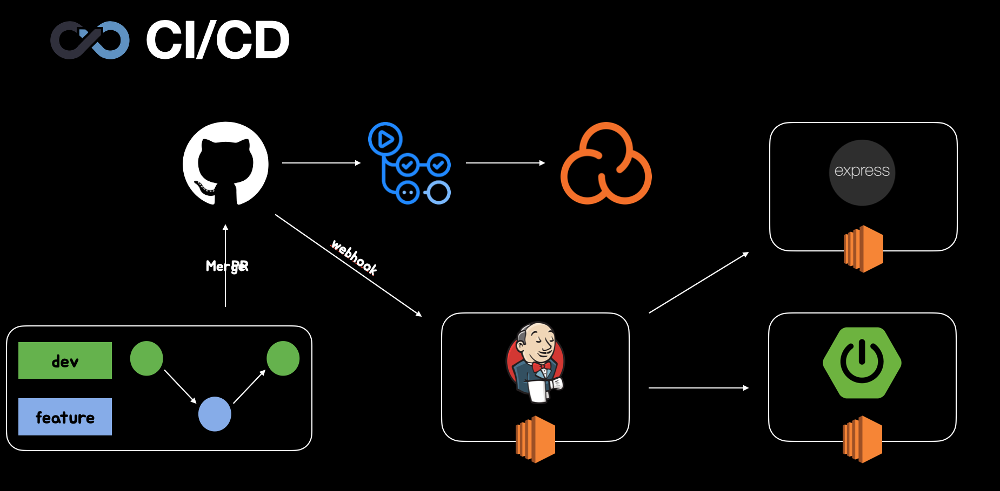

안녕하세요 공책팀의 백엔드 개발을 맡고 있는 범고래입니다.

2차 스프린트까지 진행하면서 서비스 배포 및 인프라 구성을 하게 됐는데요.

이번 포스팅은 현재 공책 서비스의 백엔드 인프라 소개 및 설명에 대해 작성해보려 합니다. (참고로 백엔드 인프라에 대한 설명만 포함하고 있습니다.)

## 현재 공책 서비스 인프라

현재 공책 팀의 CI/CD 구성과 인프라 설계도 인데요.

백엔드는 jenkins 서버, 개발 배포 서버, 운영 배포 서버 이렇게 세 개의 ec2 인스턴스를 사용하고 있습니다.

개발 서버는 운영 서버에 배포하기 전, 문제가 없는지 QA에 대한 진행을 하는 용도로 사용 되고 있습니다. 운영 서버에 배포한 후에 문제가 발생하면 실 사용자가 있을 시 문제가 생길 수 있다는 판단하에 이와 같이 구성했습니다.

또한 아직 DB 서버는 존재하지 않고, h2를 사용하고 있습니다. 이 과정은 3차 스프린트 때 추가될 것 같습니다.

### sonarcloud를 도입한 이유

저희는 CI과정에서 github actions와 sonarcloud를 사용했습니다. PR을 요청한 코드가 문제가 없는지 모든 백엔드 크루가 리뷰를 하며 검증 후, 모두가 approve가 완료되면 merge하는 과정을 거쳤습니다만

이 과정에서 실수로 놓치는 상황을 없애기 위해 sonarcloud를 통해 code smell을 체크하는 과정을 도입했습니다. 또한 추후에 sonarcloud를 활용하여 추가적으로 다른 기능을 활용할 수 있다는 점도 고려 요소 중 하나였습니다.

### github actions를 사용한 이유

우테코에서 프로젝트를 진행하면서 ec2 인스턴스를 중간에 부여받았는데요. 우테코에서 서버를 받기 이전에 저희는 Github Actions를 통해 CI를 어느정도 구축을 해놓은 상태였습니다. 서버를 받은 이후에 CI 과정을 jenkins로 옮길 수 있었지만, 저희의 CI 과정(PR부터 merge)은 github에서 수행되기 때문에 github에 좀 더 친화적인 github actions를 계속 유지해도 좋을 것 같다는 판단으로 github actions로 CI 하는 것을 유지했습니다.

### CI/CD 과정 요약

1. PR을 날리면 Github actions가 빌드 과정을 거친다.
2. 빌드 완료 후 sonarcloud가 PR을 날린 정적 코드를 분석하여 code smell을 체크한다.
3. 1번과 2번의 과정을 거친 후, 문제가 없을 시 merge를 한다.
4. merge를 하게 되면 github가 webhook을 jenkens서버로 날리게 된다.
5. 요청을 받은 jenkins 서버는 프로젝트를 clone한 후, 빌드 과정을 거쳐 jar 파일을 서버로 보낸다.
6. jenkins를 통해 jar파일을 받은 서버는 해당 파일을 배포한다.