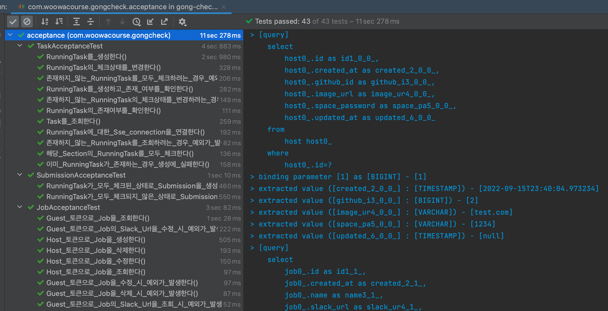
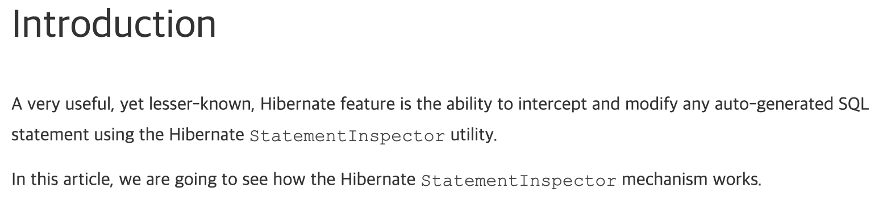
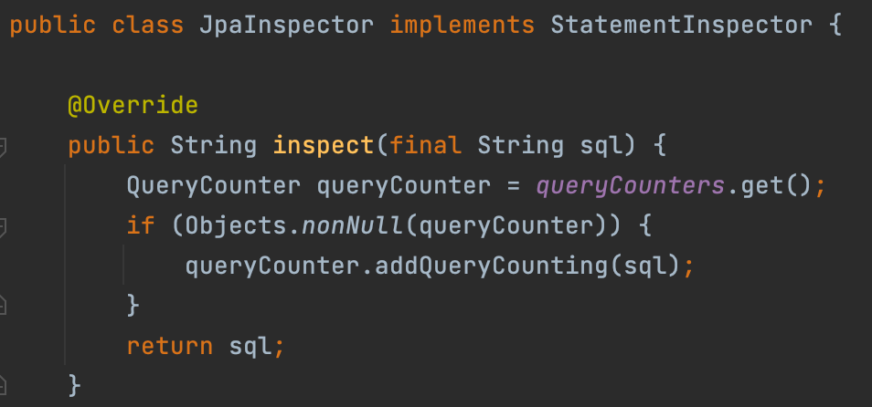
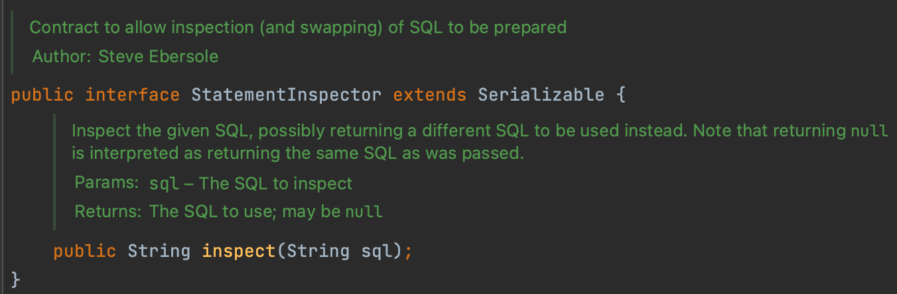
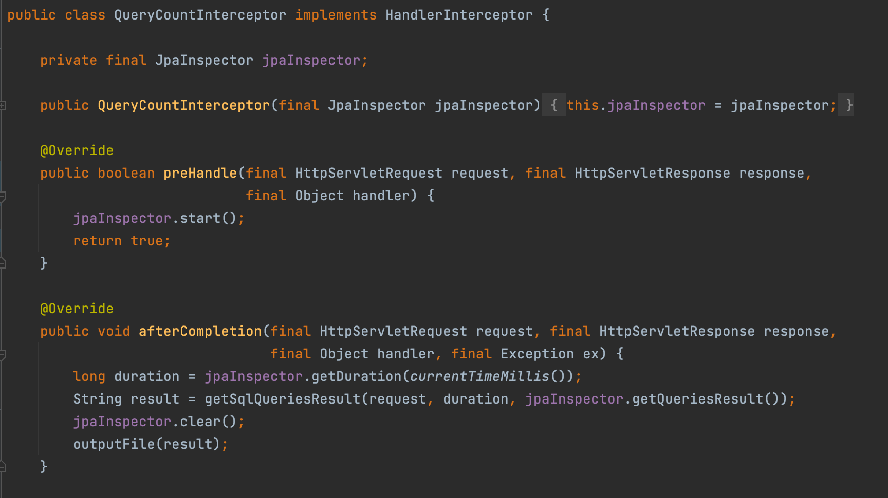
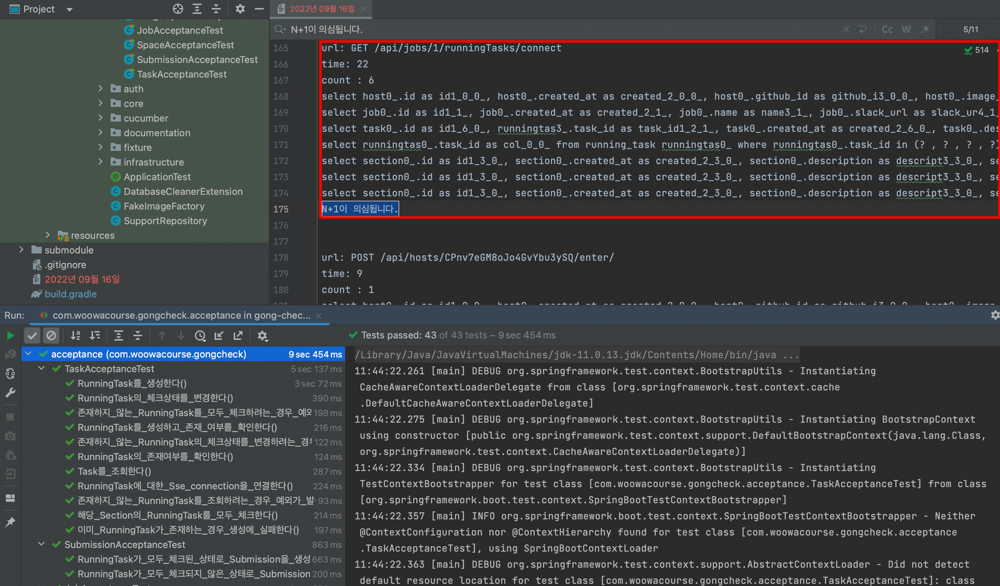
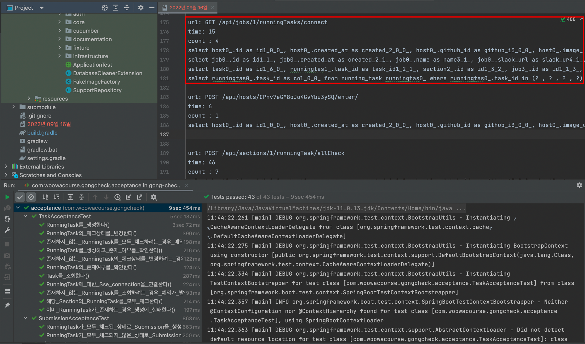

# JPA N+1 문제 찾아 삼만리

안녕하세요 공책팀에서 백엔드 개발을 맡고 있는 범고래입니다.

이번에 프로젝트에 JPA를 사용하면서 N+1 문제가 발생하는 곳을 찾고, 해결하는 시간을 가졌는데요.

## N+1 문제란?

```
💡 N + 1문제란 1번의 쿼리를 실행했을 때 의도치 않게 N번의 쿼리가 추가적으로 실행되는 것을 말합니다.
예를 들어, 하나의 엔티티를 조회했을 때 그것과 연관된 다른 엔티티를 다시 조회하여 비효율이 발생하는 상황 등이 있습니다. 여러 번의 쿼리를 날리는 것이 아니라, 한번 조회할 때 한 번에 조회하는 것이 더 효율적일텐데 말이죠.
```

처음 개발할 때 부터 N+1 문제는 없는지 테스트하며 사용했으면 좋았겠지만, JPA를 학습하며 프로젝트를 진행했기 때문에 당시엔 미처 파악하지 못한 메서드가 프로젝트 내에 존재했습니다.

이를 해결하기 위해 어떤 방식으로 N+1 문제를 찾았고, 어떻게 문제가 발생했는지에 대한 내용을 소개해볼까합니다.

---

## 처음 N+1 쿼리 문제를 찾는 과정



🤔 처음 접근했던 방식은 인수 테스트를 실행했을 때, 발생하는 쿼리를 하나하나 다 찾아 보는 것이었는데요.
이렇게 보기엔 테스트 개수도 적지 않을 뿐더러, api를 호출할 때 마다 어떤 쿼리가 몇개가 발생하는지 등 한 눈에 파악하기가 힘들었습니다.

이를 해결하기 위해서, 인수 테스트 전체를 실행하면 api 호출 마다 몇 개의 쿼리가 나가는지, n+1이 의심이 가지는 않는지 등을 한 눈에 볼 수 있게 파일로 추출해주는 라이브러리가 있으면 어떨까라는 생각을 하게 됐습니다.

## 라이브러리 구현 설계

### **StatementInspector 인터페이스 활용**



```
💡 StatementInspector는 SQL문을 가로채고 수정할 수 있는 기능을 제공하는 인터페이스 입니다.

모든 Hibernate SQL문을 가로채 실행되기 전에, SQL문을 변경하여 실행할 수도 있는 신기한 친구입니다.

이것을 사용해서 현재 문제를 어느 정도 해결해 줄 수 있을 것 같다는 생각이 들었습니다.
```

이미지 출처: [https://vladmihalcea.com/hibernate-statementinspector/](https://vladmihalcea.com/hibernate-statementinspector/)

### 문제 정의

💡 위 설명을 보고 간단하게 Interceptor와 StatementInspector를 활용하면 될 것 같은데요.
먼저 어떤 문제를 해결할 것인지를 정의해 보았습니다.

```
1. 하나의 api를 실행하는 동안 걸리는 시간
2. 쿼리가 실행된 개수
3. 어떤 쿼리들이 실행되었는지 리스트업
4. n+1이 의심되는 로직 체크 (저는 동일한 select 문이 2개 이상 사용한다면, n+1을 의심해 볼 만한 상황으로 판단했습니다. )
5. 1~4번까지를 기록하여 파일로 추출
```


## 라이브러리 구성

생각보다 구현 로직이 간단해서 빠르게 진행해 봤는데요.

핵심 로직을 수행하는 `JpaInspector`, `QueryCountInterceptor` 가 어떤 역할을 하는지 간단하게만 언급하고 자세한 내용이 궁금하시다면 [실제 코드](https://github.com/sogorae/jpa-query-counter)를 봐도 좋을 것 같습니다.

### JpaInspector로 SQL 가져오기






```
💡 StatementInspector를 implements하고 있는 JpaInspector 클래스를 작성했습니다.
inspect를 Override 하면 실행될 sql문을 가로챌 수 있는데요.

해당 메서드를 통해 API당 발생하는 `sql문을 저장`하고 `쿼리 개수`를 세주는 작업을 했습니다.
```

## QueryCountInterceptor로 JpaInspector관리하고 필요한 정보 파일로 추출하기



```
💡 `QueryCountInterceptor` 의 preHandle에서 api 요청이 올 때 마다, jpaInspector의 start()를 호출하여 `JpaInspector` 의 `QueryCounter` 객체를 초기화 합니다.

그리고 `afterCompletion` 에서 JpaInspector에서 필요한 정보를 가져와 파일로 추출합니다.

위와 같이 크게 `JpaInspector`, `QueryCountInterceptor` 등으로 구성된 프로젝트를 jitpack을 사용해 라이브러리로 배포했습니다.
```

## 사용법(https://github.com/sogorae/jpa-query-counter)

```
repositories{
    mavenCentral()
    maven{url 'https://jitpack.io'}
}

dependencies { 
	...
	implementation 'com.github.sogorae:jpa-query-counter:1.0.4'
}
```

위와 같이 build.gradle에 **`maven{url 'https://jitpack.io'}`, `implementation 'com.github.sogorae:jpa-query-counter:1.0.4'`** 를 추가한 후, e2e 테스트(ex. 인수 테스트)를 실행하면 원하는 정보가 파일로 추출됩니다.

## 실행 결과



위와 같이 실행된 쿼리 정보 파일을 보고 한 눈에 파악할 수 있게 되었습니다.

## N+1 및 잘못된 쿼리 수정 결과



여기까지 어떻게 N+1 문제를 찾았는지에 대한 내용을 다뤄보았는데요.

다음 글에는 공책 팀에서 n+1 문제, 예상치 못하게 발생한 잘못된 쿼리가 무엇이고 어떻게 해결했는지에 대해 다뤄보겠습니다.

**참고:** [https://docs.jboss.org/hibernate/orm/5.2/javadocs/org/hibernate/resource/jdbc/spi/StatementInspector.html](https://docs.jboss.org/hibernate/orm/5.2/javadocs/org/hibernate/resource/jdbc/spi/StatementInspector.html)
[https://vladmihalcea.com/hibernate-statementinspector/](https://vladmihalcea.com/hibernate-statementinspector/), [http://knes1.github.io/blog/2015/2015-07-08-counting-queries-per-request-with-hibernate-and-spring.html](http://knes1.github.io/blog/2015/2015-07-08-counting-queries-per-request-with-hibernate-and-spring.html)
