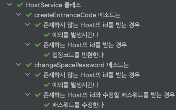

안녕하세요 공책팀에서 백엔드 개발을 맡고 있는 오리입니다.

저희 팀은 테스트코드에 대해서 중요하게 생각하고 있고 이를 항상 개선해나가려고 노력하고 있는데요.
그 중 첫번째로 DCI 패턴을 적용하여 테스트코드를 개선해나간 이야기를 해볼까 합니다.

---

## 이전 테스트 코드의 문제점

지금까지는 사실 팀원들 각자의 테스트코드에 대한 생각이 달랐고, 여러가지의 테스트코드가 작성되었습니다.
그 중 몇가지 예를 가져왔어요.

```java
@Test
void 다른_Host의_Space의_Job_목록을_조회할_경우_예외를_던진다() {
    Host host1 = hostRepository.save(Host_생성("1234", 1234L));
    Host host2 = hostRepository.save(Host_생성("1234", 2345L));
    Space space = spaceRepository.save(Space_생성(host2, "잠실"));

    assertThatThrownBy(() -> jobService.findJobs(host1.getId(), space.getId()))
            .isInstanceOf(NotFoundException.class)
            .hasMessage("존재하지 않는 공간입니다.");
}

```

가장 많이 볼 수 있었던 유형의 테스트코드에요. 테스트 메소드 하나가 모든 테스트코드를 담고 있는 코드죠.

지금과 같이 짧은 테스트코드의 경우 테스트를 진행하기 위해 어떤 값을 필요로 했는지, 어떤 행위를 테스트하고자하는지 눈에 잘 보이기도 하는데요. 문제는 테스트코드가 길어지면 길어질수록 하나의 테스트코드를  바라보았을 때 어떻게 값을 세팅했는지, 어떤 행위를 테스트하고자하는지 읽기 힘들어지는 경우가 많아집니다.

이를 위해서 setup 메소드를 두기에도 다른 테스트코드와 중복되지 않은 코드에 대해서는 setup을 하지 못하기 때문에 해결책이 되지는 않습니다. 값을 세팅하기 위한 메소드를 만들기에도 어떻게 값을 세팅하였는지 테스트가 길면 가독성에 이상이오기는 마찬가지였어요.

```java
@Nested
class Job을_수정한다 {
    Host host;
    Space space;
    List<TaskCreateRequest> tasks;
    List<SectionCreateRequest> sections;
    JobCreateRequest jobCreateRequest;
    Long savedJobId;

    @BeforeEach
    void setUp() {
        host = hostRepository.save(Host_생성("1234", 1234L));
        space = spaceRepository.save(Space_생성(host, "잠실"));
        tasks = List.of(new TaskCreateRequest("책상 닦기"), new TaskCreateRequest("칠판 닦기"));
        sections = List.of(new SectionCreateRequest("대강의실", tasks));
        jobCreateRequest = new JobCreateRequest("청소", sections);
        savedJobId = jobService.createJob(host.getId(), space.getId(), jobCreateRequest);
    }

    @Test
    void 기존의_존재하는_Job을_삭제한_후_새로운_Job을_생성하여_수정한다() {
        Long updateJobId = jobService.updateJob(host.getId(), savedJobId, jobCreateRequest);

        assertThat(updateJobId).isNotNull();
    }

```

그래서 개선해서 나온 테스트코드입니다.

어떠한 테스트하고자하는 메소드에 대해서 `@Nested` 로 묶고 해당 메소드가 사용하는 값에 대해서 setUp으로 공통된 부분을 최대한 처리하는거죠.

해당 방법도 문제가 있기는 마찬가지였어요. 각각의 테스트코드가 필요로 하는 setUp 값이 다른 경우가 많았거든요. 테스트마다 상황은 항상 다르게 일어나니까요. 그리고 구체적인 작성 패턴이 없다보니 팀 내부에서 받아들이는데 시간이 오래걸려서 테스트코드에 대한 일관성이 많이 깨졌습니다.

---

## 새로운 테스트 방법을 찾는 과정
이러한 테스트코드에 대한 문제점을 해결하고자 다음과 같은 기준하에 여러 방법을 찾아봤어요.

> 1. 팀에서 공통적으로 학습하고 통일성있게 작성할 수 있는 작성 패턴을 찾는다
> 2. 테스트 코드는 처음보는 사람이 무엇을 테스트하고자하는지 알 수 있을만큼 가독성이 높아야 한다.
> 3. 실패한 테스트에 대해서 어떤 테스트가 실패했는지 찾기 쉬워야 한다.

다양한 테스트 개발론이 있지만 기본으로 위와 같은 기준점으로 잡고 갔기 때문에 BDD 개발론을 충실히 수행할 수 있는 패턴이었dㅡ면 좋겠다라는 생각을 했어요.

팀원 모두 일단 BDD방법론 중 given-when-then 패턴에 대해서 익숙하기 때문에 도입에 있어서 큰 어색함이 없을 것이라 생각했거든요. 테스트에 대한 행위를 중심으로 테스트코드를 작성하면 위의 3가지 목적에 부합한다라는 생각도 했구요.

다만 given-when-then의 방법을 그대로 사용하기에는 문제가 있었습니다. given-when-then이 물론 좋은 방법이기는 했지만 결국 처음 이야기했던 테스트가 given-when-then 패턴을 따라가고 있었기 때문이에요. 상황에 대한 시나리오도 좋지만 테스트의 주 행동에 대해서 더 구체적이고 분리하면서 테스트를 작성하고 싶었거든요. 그래서 해당 패턴을 사용한다고 해도 지금의 문제를 크게 해결해줄 것 같지는 않았습니다.

그래서 더 좋은 방법이 없을까라고 찾아보다가 DCI 패턴을 알게되었어요.

---

## DCI 패턴
Describe-Context-It 패턴은 정확하게 하나의 테스트 메소드에 대한 행위를 검증하는데 있어요. 테스트할 대상을 두고(`Describe`) 대상이 실제로 놓이게 되는 상황을 설정하고(`Context`) 대상을 실행하고 검증하죠(`It`).

given-when-then과는 다르게 시나리오적인 요소보다는 실제 테스트할 대상에 대해서 두고 분리하기 때문에 조금 더 가독성있을 것 같다라는 생각을 했어요.
또한 작성법을 타 언어와 같이 DCI를 제공하지는 않지만(kotest 등) `@Nested`를 사용하여 각각의 계층에 대해서 분리함으로써 원하는 부분에 대해서 쉽게 제어가 가능할것이라고 생각했구요.

그럼 실제로 적용하면서 DCI 패턴에 대해서 이야기를 이어나가겠습니다.

---

## DCI 패턴 적용
일단 팀 내에서 공통적으로 사용할 테스트 작성법이 필요했기 때문에 DCI 패턴을 사용할 때도 저희의 기준을 정하기로 했어요.

- `Describe` : 테스트할 대상을 display
    - 테스트할 메소드를 명시한다.
- `Context` : 테스트할 대상이 실제로 놓이게 되는 상황을 설정
    - 테스트 대상을 실행하기 전 입력값으로 놓이는 값, 대상이 놓이게 되는 환경을 구성한다.
- `It` : 테스트 대상을 실행하고 검증
    - 테스트할 메소드를 실행한다.
    - 테스트할 메소드를 검증한다.

각각의 구조에 대해서는 `@Nested`를 통해서 계층으로 분리를 진행하였는데요. 이렇게 구분된 상황들을 실제로 테스트를 돌려보면 아래와 같은 모습을 볼 수 있습니다.

<div align="center">
	
</div>

일반적인 테스트코드와는 결과가 많이 다른것을 볼 수 있습니다. 계층형으로 각각의 테스트를 진행하기 때문에 일반적인 테스트보다 더 각각의 테스트가 어떤 테스트를 진행하고 있는지 확인하기 쉽고, 필요없다면 특정 테스트를 폴딩하여 숨길수도 있습니다.

여기서 가장 중요한 것은 DCI를 적용한다해서 각각의 네이밍이 따로 노는 것이 아닌 한줄로 이어보았을 때 어떤 테스트 상황을 명시하는지 확인하기 쉽도록 네이밍을 지어야한다는 것인데요. 보통 작성하는대로 각각의 메소드 네이밍을 따로두게 된다면 읽을 때 하나의 흐름으로 읽지 못하게 됩니다. 따라서 `Describe`, `Context`, `It`이 하나의 흐름으로 이어지게끔 네이밍을 주는 것이 좋습니다. 그럼 아래와 같이 읽을 수 있는 테스트코드가 만들어지거든요 :)

```
Describe : createEntranceCode 메소드는
Context : 존재하지 않는 Host의 id를 받는 경우
It : 예외를 발생시킨다.

createEntranceCode 메소드는 존재하지 않는 Host의 id를 받는 경우 예외를 발생시킨다.
```

그럼 코드를 보면서 조금 자세하게 코드로 적용할 수 있는지를 알아보겠습니다.
```java
@Nested
class changeSpacePassword_메소드는 {

    @Nested
    class 존재하는_Host의_id와_수정할_패스워드를_받는_경우 {

        private static final String ORIGIN_PASSWORD = "1234";
        private static final String CHANGING_PASSWORD = "4567";
        private static final long GITHUB_ID = 1234L;

        private SpacePasswordChangeRequest spacePasswordChangeRequest;
        private Long hostId;

        @BeforeEach
        void setUp() {
            spacePasswordChangeRequest = new SpacePasswordChangeRequest(CHANGING_PASSWORD);
            hostId = hostRepository.save(Host_생성(ORIGIN_PASSWORD, GITHUB_ID))
                    .getId();
        }

        @Test
        void 패스워드를_수정한다() {
            hostService.changeSpacePassword(hostId, spacePasswordChangeRequest);
            Host actual = hostRepository.getById(hostId);

            assertThat(actual.getSpacePassword().getValue()).isEqualTo(CHANGING_PASSWORD)
        }
    }
}

// Describe : changeSpacePassword_메소드는
// Context : 존재하는_Host의_id와_수정할_패스워드를_받는_경우
// It : 패스워드를_수정한다
```

먼저 `Describe`는 테스트할 대상을 명시하기 때문에 대부분의 케이스에서 "메소드"에 해당합니다. 특정한 시나리오에서라기보다는 테스트할 대상의 행위에 초점을 맞추고있는 디자인패턴이기때문에 메소드를 명시함으로써 저희가 테스트할 대상을 확실히 확인할 수 있습니다.

다음으로 `Context`입니다. 테스트 대상이 놓여있는 상황을 구성하는 방법은 여러가지가 있을 수 있는데요. 저희팀에서는 아래와 같은 기준에서 상황을 구성하기로 했어요.

```
1. 테스트 값을 구성하는 경우 setUp() 메소드에서 진행하도록 한다.
    - 단 값을 구성하는 과정이 길어 setUp()에서 넣기 부담스럽다면 Describe에서 공통적으로 세팅하는것이 아닌 생성 메소드로 분리하여 사용한다.
    - Describe에서는 오로지 테스트할 대상을 명시하는 용도로만 사용하며 값 구성은 전부 Context에서 진행하여야 한다.
2. It에서 사용해야하는 의미있는 변수의 경우 Context의 클래스 변수로 두고, 사용하지 않는다면 setUp()에서만 사용하고 클래스 변수로 지정하지 않는다.
3. It에서 사용해야하는 의미있는 값은 Context에서 상수로 지정한다.
```

이를 통해서 얻고자하는 바는 실패하는 테스트를 보거나 테스트를 수정하는 상황이 되었을 때 수정점을 알기 쉽게 분리하기 위함입니다.
- it에서 사용하는 테스트 검증 값
- 테스트 대상이 놓인 상황을 구성하는 영역

위와 같이 구분함으로써 테스트의 모든 영역에 대해서 읽는 수고를 들이지 않더라도 한번에 제가 원하는 영역을 찾아 수정할 수 있게 되는 것이죠.

이렇게 `Describe`와 `Context`를 구성하게 된 이후 `It`은 아주 간단해집니다. "테스트 대상의 실행", "실행에 대한 검증"

사실 지금까지 정확한 기준점을 잡았던 이유는 `It`을 위함이라고 생각합니다. 즉, `It`은 의도적으로 간단하게 만들어놓은거죠. 테스트에서 가장 중요한 것은 내가 어떤 테스트를 진행했고 그 테스트가 잘 수행되었는지 확인하는 것인데요. `It`을 통해 그 행위를 검중함과 더불어 간단하게 `It`을 구성함으로써 보다 쉽고 빠르게 테스트 검증 메소드부분을 확인할 수 있는거죠.

--- 

## 마냥 장점만 있는 것은 아니다
지금까지 DCI 패턴을 적용하기 위한 과정들을 이야기했으나 결론은 DCI 패턴이 좋으니 적용하자는 아닙니다.

DCI 패턴이 물론 장점이있기는 몇가지 상황에는 다른 방법이 더 좋을 수도 있거든요. 예를 들면 굳이 특정 대상을 명시하지 않아도 되었던 documentation테스트, BDD가 아닌 하나의 단위에 대한 TDD를 진행해야하는 테스트, 진행하는 시나리오가 더 중요한 인수테스트 등이 있을 수 있습니다.

따라서 저희팀 내에서도 아직까지는 DCI 패턴을 모든 영역에 대해서 적용하지 않고 application, repository 영역에 대해서만 진행하고 있습니다.
 적절한 상황에 대해서 논의하고 적절한 방법을 사용하여 테스트를 진행하는 것이 무엇보다 중요하니까요.

지금까지 저희팀에서 적용하면서 반신반의하며 DCI 패턴을 적용함으로써 개선될까하는 부분들이 많았지만 도입을 하고 익숙해진 지금 대부분의 팀원이 호의적인 반응이었던 것 같아요. 아직까지도 DCI 패턴을 잘 사용하며 공통된 영역을 잘 분리하지는 않았지만 주기적으로 리팩터링하며 테스트를 만들어나가다보면 안정적인 저희만의 테스트를 만들어나갈 수 있을거라 생각이 듭니다 :)
