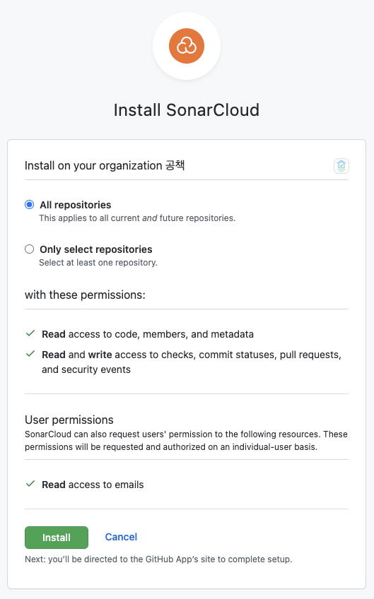
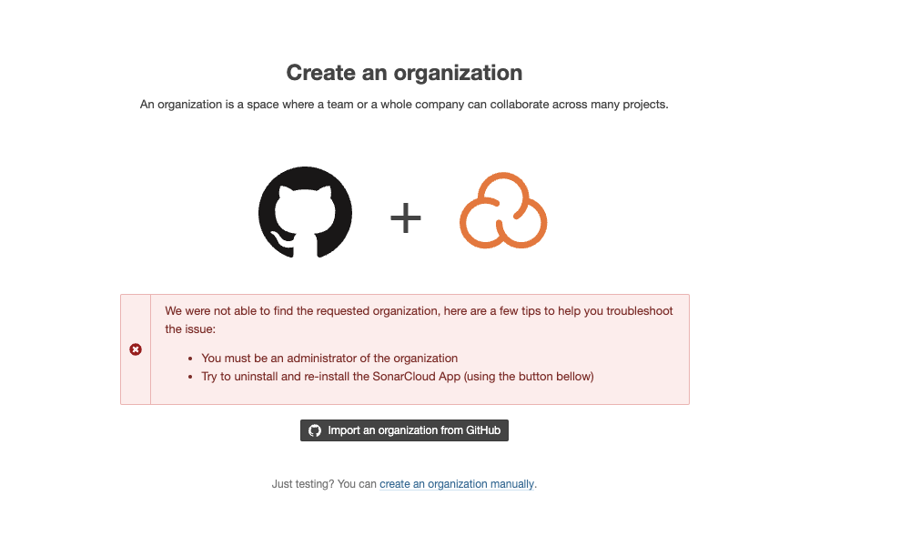
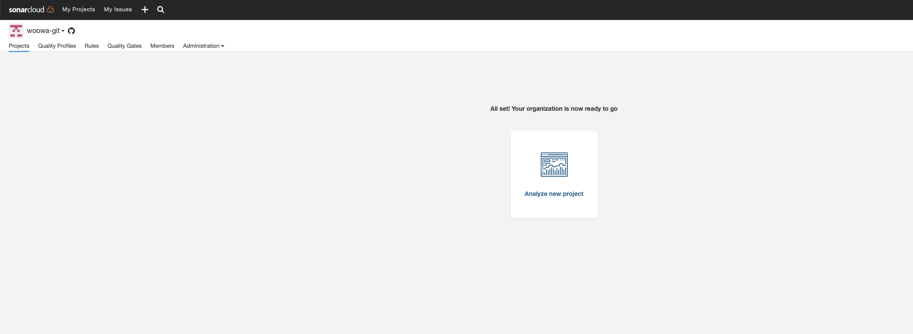
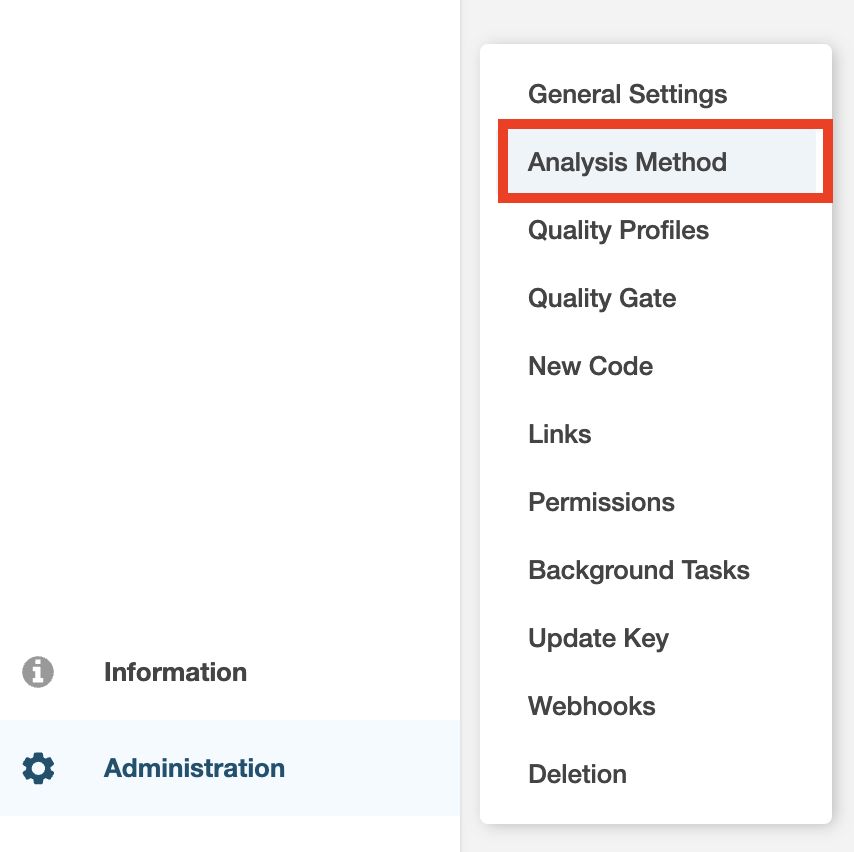
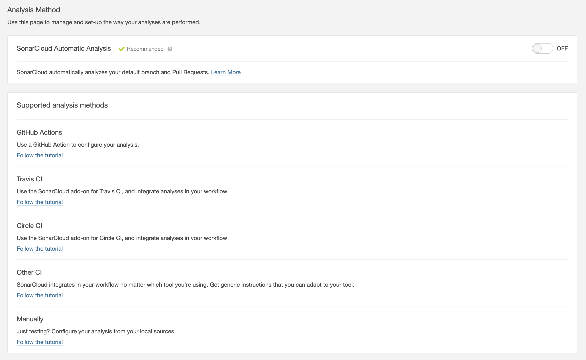
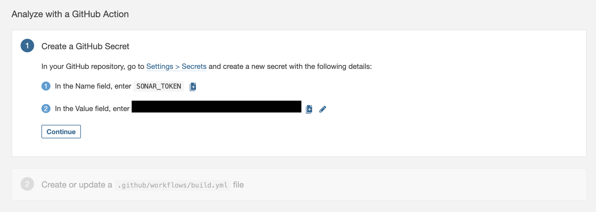
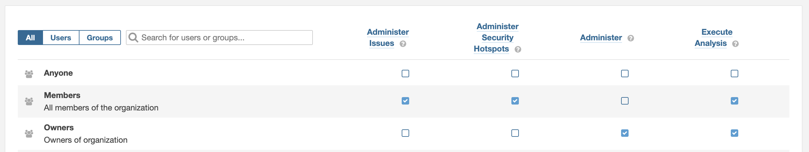
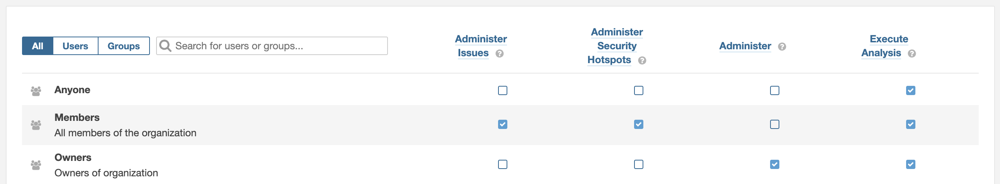
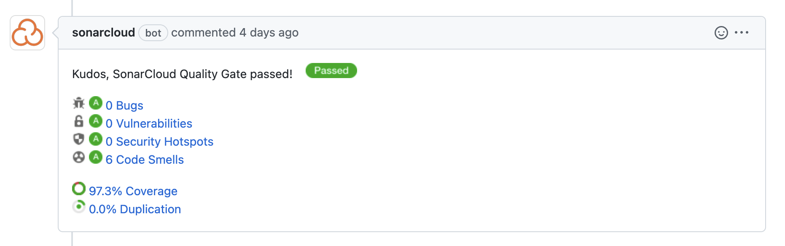

안녕하세요 공책팀에서 백엔드 개발을 맡고 있는 오리입니다 :)

이번 글에서는 저희 팀에서 SonarCloud를 적용하면서 생겼던 문제들에 대해서 이야기해볼까 해요.


## SonarCloud 도입 배경

프로젝트를 진행하다보면 많은 코드리뷰가 진행이 되고 진행이 될수록 아래와 같은 고민을 하게 되었어요.
> 프로젝트의 코드 수준을 올리고 싶다.
> 
> 이를 위해서 모두가 코드리뷰를 하지만 정확한 분석이 있었으면 한다.

백엔드의 경우 5명의 팀원이 코드리뷰를 잘해주고 있기는 하지만 사람마다 보는 기준이 다르기도 하고, 사람인지라 보지못하고 넘어가는 코드들도 많았어요.
코드에 대한 일관성을 지키고나가야 프로젝트가 오래 진행되었을 때 유지보수하기 편한 코드가 된다라는 생각을 하게 되었습니다.

결국 코드 품질을 올리는 여러가지의 방법이 있지만, 아무래도 백엔드 개발자이다보니 눈에 보이는 리포트가 있으면 좋겠다라는 생각을 했어요.
`테스트코드`에서 테스트가 모두 통과하면 정상적으로 로직을 잘 구현한지 확인할 수 있다거나, `build`가 정상적으로 돌아간다거나 하는 등과 같은 가시적인 리포트가 필요했던 거죠.

그러던 와중 `SonarCloud`라는 code analysis 서비스를 확인하게 되었고 Pull Request에서 리포트 형식의 결과물을 보여주는 코드 품질을 확인하기 위해서 도입하게 되었습니다 :)

## SonarCloud란
> SonarCloud is a cloud-based code analysis service designed to detect code quality issues in 25 different programming languages, continuously ensuring the maintainability, reliability and security of your code.

SonarCloud는 말그대로 정적 코드 분석입니다. 각각의 개발 언어에서 지정된 코드 품질에 대한 포맷을 가지고 코드를 분석하여 코드의 유지보수성, 안정성 및 보안 등을 지속적으로 관리해주죠.

SonarCloud는 issue와 security hotspot이라는 클 틀안에 [관리](https://docs.sonarcloud.io/#what-does-sonarcloud-detect) 를 해주며, 수정할 수 있는 각각의 문제들에 대한 리포트를 제공해줍니다.

위처럼 제공한다면 36개의 code smell과 커버리지에 대한 이슈를 확인할 수 있을 것 같아요.

다만 SonarCloud는 기본적으로 Automatic Analysis 방식을 default옵션으로 제공하는데요, 지금부터 진행하게될 SonarCloud의 방식은 해당 옵션을 사용하는 것이 아닌 CI-based Analysis 방식을 사용하게되기 때문에 어떻게 CI-based 방식으로 변경하였는지를 이야기해볼까 합니다.

> Automatic Analysis 방식은 Jenkins나 github action과 같은 CI 툴을 사용하지 않고 자동으로 SonarCloud에서 분석해주는 방식을 말해요. SonarCloud 서비스에 저희 github repository에 대한 권한이 있고 등록하여 설정만 해둔다면 repository에 올라온 코드에 대해서 트리거를 알아서 발생시키고, 자동으로 분석 결과를 보내주는 방식이죠.
> 
> 해당 방식을 고려하지 않은 이유는 Automatic Analysis를 사용하게 되었을 때 자동적으로 들어오는 리포트의 타이밍을 제가 컨트롤하고 싶다라는 생각이 들었고, 굳이 CI를 따로 진행하는데 해당 스크립트에 CI-based를 추가하여 사용하지 않을 이유가 없었기 때문입니다.
> Automatic Analysis에 대한 설명은 아래 링크를 참고해주시면 좋을 것 같아요!
> 
> https://docs.sonarcloud.io/advanced-setup/automatic-analysis/


## SonarCloud 간단 적용
앞서 이야기한대로 CI-based 방식을 사용하고자했기 때문에 몇가지 작업들을 거쳐야해요. CI build 스크립트를 짜고, (gradle프로젝트를 기준으로) build.gradle에 스크립트를 수정하는 등과 같은 작업들을 거쳐야합니다. 하지만 기본적으로 SonarCloud에서는 튜토리얼에 맞게 모든 튜토리얼 코드들을 잘 제공해주기 때문에 "잘" 따라서 가기만한다면 문제없이 적용할 수 있습니다.


먼저 SonarCloud에서 분석할 Repository의 상위 Organization account에 SonarCloud를 설치해야합니다.

본인이 아닌데 코드분석을 요구하게 될 경우 보안적인 이슈가 많을 것이므로 많은 보안 정책을 따라주어야해요. 따라서 SonarCloud에서 분석을 진행하기 위해서는 repository를 관리하는 상위단의 Organization account에 SonarCloud를 설치해두는 것이죠. (개인이라면 개인 계정에 설치합니다.)
<div align="center">
	
</div>

> Organization을 생성하기는 하지만 해당 Organization에서 분석을 진행할 수 있는 Repository 목록 또한 제어할 수 있어요. All을 누르지 않고 select를 누르게 된다면 SonarCloud에서는 해당 repository에 대한 추가만 가능하게 됩니다. github단에서 먼저 Organization에서 분석 접근할 수 있는 Repository에 대한 제한을 두는 것이죠.
> 
> 까다롭기는 하지만 repository에 대한 보안적인 부분들도 많이 있을테니 어쩔수없는 불편함이라고 생각합니다.
<div align="center">
	
</div>

잘 진행했다면 아래와 같은 빈 화면을 볼 수 있습니다.
<div align="center">
	
</div>


그럼 이제는 분석을 진행할 repository를 선택하면 자동으로 Automatic Analysis가 진행됩니다. 다만 저희는 Automatic Analysis를 사용하는 것이 아닌 CI-based Anaylsis를 사용하기 때문에 해당 옵션을 꺼주어야해요. (SonarCloud에서는 두가지의 Anaylsis를 중복해서 사용하는 것을 막고있으므로 Automatic Anaylsis를 꺼주어야합니다.)

따라서 아래와 같이 Anaylsis Mode로 이동하도록 하겠습니다.
<div align="center">
	
</div>

이동하게 된다면 아래와 같은 페이지가 나오게 되는데요. 당연하게도 `SonarCloud Automatic Analysis`는 OFF로 두고 그 아래에 있는 옵션들을 보려고 해요.
<div align="center">
	
</div>

각각의 Supporting 해주는 튜토리얼들이 나와있습니다. SonarCloud에서는 튜토리얼을 잘 제공해주고 있기 때문에 사용하는 CI도구들에 따라서 맞게 해주면 될 것 같아요.

지금은 간단하게 Github에서 제공하는 Github Actions를 통해서 튜토리얼을 진행해보려고 합니다. 그래서 들어가면,
<div align="center">
	
</div>
의 형태로 `SONAR_TOKEN`을 제공합니다. 이때 해당 토큰의 경우 SonarCloud로 전달하는 키가 되기 때문에 Guthub Actions에서 트리거를 확인하고 리포트를 전달하기 위해서는 해당 토큰이 필요해요. 따라서 제공되어있는 Repository의 `Settings > Secrets` 경로에 가서 해당 토큰을 추가하는 것으로 튜토리얼을 시작합니다.

이후에는 각자가 사용하는 build 환경에 맞게 스크립트를 제공하므로 적절한 환경에서 사용하면 될 것 같아요.
저희 프로젝트의 경우 백엔드는 Gradle, 프론트는 SonarSource에서 제공하는 sonarcloud-github-action@master를 사용하였습니다.

이때 주의해야할 점은 SonarCloud로 리포트를 만들어내기 위해서 sonar에 대한 속성값을 지정해주어야합니다. Gradle의 경우 `build.gradle`에 존재하고, 다른 스크립트도 properties를 추가하는 등 속성값을 지정해주어야 스크립트 진행시에 전달할 repository의 올바른 경로로 진행이 됩니다.
```groovy
// build.gradle

sonarqube {
  properties {
    property "sonar.projectKey", "woowa-git_java-baseball-precourse"
    property "sonar.organization", "woowa-git"
    property "sonar.host.url", "https://sonarcloud.io"
  }
}
```
```properties
## sonar-project.properties

sonar.projectKey=woowa-git_java-baseball-precourse
sonar.organization=woowa-git
```

위의 속성들은 기본적으로 무조건 명시해주어야하는 조건이므로 추가적으로 속성값을 커스텀할 수도 있습니다.

자세한건 [공식 docs 링크](https://docs.sonarcloud.io/advanced-setup/analysis-parameters) 를 참고하면 좋을 것 같습니다 :)

## 진행했던 트러블 슈팅
### 1. Jacoco
 스프링 백엔드 환경에서 가장 처음 실수는 테스트 커버리지였습니다. 일단 이전에 이야기한대로 "정적" 분석이기 때문에 SonarCloud에서는 본인들이 알아서 테스트를 돌려 커버리지에 대한 리포트를 남기기가 힘듭니다.

 따라서 build를 진행하고 리포트를 만들 때 테스트커버리지에 대한 리포트도 남겨주어야해요. 아니면 찾지못하고 아래와 같은 메시지를 남기죠.
```
No coverage report can be found with sonar.coverage.jacoco.xmlReportPaths='build/reports/jacoco/test/jacocoTestReport.xml'. Using default locations: target/site/jacoco/jacoco.xml,target/site/jacoco-it/jacoco.xml,build/reports/jacoco/test/jacocoTestReport.xml
No report imported, no coverage information will be imported by JaCoCo XML Report Importer
```

 `build.gradle`에서는 따로 이 환경을 제공하지 않고 `jacoco`라는 java 코드 커버리지 라이브러리를 사용해야합니다. `jacoco`가 build진행 시 돌렸던 테스트에 대한 `.xml` 리포트문서를 만들고 SonarCloud는 그걸 받아 분석용으로 보여주기만 하는거죠.

```groovy
plugins {
    ...
    id 'jacoco'
}

tasks.named('test') {
    useJUnitPlatform()
    finalizedBy 'jacocoTestReport'
}

jacocoTestReport {
    reports {
        html.enabled true
        xml.enabled true
    }
}

sonarqube {
    properties {
        ...
        property 'sonar.coverage.jacoco.xmlReportPaths', 'build/reports/jacoco/test/jacocoTestReport.xml'
    }
}
```
- (jacocoTestReport의 진행 스크립트는 finalizedBy나 dependsOn이나 동작구동하게끔만 진행하면 괜찮습니다.)

따라서 위와 같이 플러그인을 추가하고, `test` Task를 진행한 후 jacocoTestReport를 실행하여 테스트에 대한 `.xml` 분석파일을 내보내도록하면 완성입니다.

별다른 옵션을 두지 않는다면 `.xml`은 `build/reports/jacoco/test/jacocoTestReport.xml`의 경로에 생성이 되는데요, `build.gradle`에서 sonar가 인식하는 default 경로가 해당 경로이기 때문에 위 코드처럼 굳이 추가는 하지않아도 됩니다.

---
### 2. sonar-project.properties
저희 팀 프로젝트는 프론트엔드, 백엔드의 프로젝트를 하나의 repository에서 관리하기 때문에 프론트의 `sonar-project.properties`를 분리할 필요가 있었는데요.

여기서 프론트 폴더의 build 스크립트 상에서는 아래와 같이 고정된 경로를 두고
```yaml
defaults:
  run:
    working-directory: frontend
```

`/frontend/sonar-project.properties`로 설정파일을 두었습니다.

의도된 SonarSource 측의 방향인지는 모르겠으나 `working-directory`를 frontend 폴더로 두어도 루트를 경로로 `sonar-project.properties`를 검색하다보니 결국 원하는 `sonar-project.properties`를 제대로 인식하지 못해서 action이 터지는 상황이 발생했습니다.
```
ERROR: You must define the following mandatory properties for 'Unknown': sonar.projectKey, sonar.organization
```
따라서 위와 같이 `sonar.projectKey`와 `sonar.organization`은 필수값인데 properties를 찾지못해 에러가 발생하는거죠.

따라서 `SonarSource/sonarcloud-github-action@master`의 경우 `working-directory`를 인식하지 못하고 루트 디랙토리로 찾게 되니 이점 유의하고 properties를 배치하면 좋을 것 같습니다.

---

### 3. Fork repositoy에서 pull request 시 github secret key 권한 에러
이부분이 가장 당황스러웠던 부분인 것 같아요. 
 
처음에도 이야기했지만 Repository의 분석을 진행하다보니 해당 repository에 대한 권한인증이 상당히 까다로운 편이었는데요. 이 내용이 Fork된 repository에서 요청을 할 때 포함이 되어버립니다.

분석에 대한 권한의 경우 아래의 Permission 옵션에서 `Execute Analysis` 옵션을 키게 되면 해결이 되는데요.
<div align="center">
	
</div>
지금 옵션의 경우 organization에 대해서 Member, Owner 권한이 있는 모든 사람의 요청은 분석이 가능하고, 다른 Anyone은 불가능합니다. Anyone에 대해서 분석을 풀어두면 organization의 유저가 아니더라고 분석 요청이 가능하겠죠. (정상적으로 돌렸는데 scret key의 에러로 권한 요청이 필요하다면 해당 부분을 수정하면 됩니다.)

여기서의 문제는 Fork Repository 였습니다.

현재는 아니지만 이전에는 저희 팀 프로젝트에서 open source project contribution 방식의 fork된 repository에서 pull request를 전송하고 있었는데요. 이때 fork repository에서의 요청에 대해서 저는 Anyone의 권한이 되어버렸어요. 따라서 백엔드, 프론트엔드의 빌드가 전체가 터져버리는 상황이 발생했습니다.

이를 아래와 같이 Anyone에 대한 권한을 풀고나니 백엔드는 되었지만, 프론트는 여전히 실패했었습니다.
<div align="center">
	
</div>

찾아보니 fork된 repository에서 요청을 하는 경우 Github에서는 scret key에 대한 권한 자체를 막아버리는 듯 했어요. [SonarSource 커뮤니티글](https://community.sonarsource.com/t/github-action-ci-build-fail-with-set-the-sonar-token-env-variable/38997/25)

문제가 되는 부분은 `SonarSource/sonarcloud-github-action@master`를 통해서 secret key를 사용하는 것이 었기때문에 당시 기준으로는 Anyone으로 모든 요청에 대한 권한은 풀어두고, 프론트에서 `sonarqube-scanner`를 직접 돌려 전송하는 방식으로 진행하였습니다.

언급했던 것처럼 현재는 fork방식을 사용하지 않고 있지만 혹시 해당 방법을 통해 전달하고 싶다면 아래의 스크립트를 추가하면 될 것 같습니다 :)
```yaml
jobs:
  sonarcloud:
    name: SonarCloud
    runs-on: ubuntu-latest
    steps:
      - uses: actions/checkout@v2
        with:
          fetch-depth: 0  # Shallow clones should be disabled for a better relevancy of analysis
      - name: Install dependencies
        run:  npm install
      - name: install sonarqube-scanner
        run: npm install sonarqube-scanner -D
      - name : run sonar
        run: npm run sonar
```
```javascript
// sonar-project.js 
const sonarqubeScanner = require("sonarqube-scanner");
sonarqubeScanner(
    {
        serverUrl: "https://sonarcloud.io",
        options: {
            "sonar.sources": "./src",
        },
    },
    () => {},
);
```
`sonar-project.js`의 경우 options에서 properties와 동일하게 커스텀하여 사용할 수 있습니다.
```json
// package.json
{
  ...
  "scripts": {
    ...
    "sonar": "node sonar-project.js"
  },
```

## 생각 정리
<div align="center">
	
</div>
사실 아직까지는 SonarCloud를 적용하고난 이후 "이건 정말 몰랐던 것들이네"의 케이스는 적었던 것 같아요. 여러명이 꼼꼼히 코드리뷰를 진행했던 덕이라고 생각합니다.

다만 언젠가 발생할 클린하지 않은, 잘못된 사용법의 코드에 대한 안전망이 생겼다라는 사실로 인해 조금 더 안심하고 pr을 볼 수 있게 되었다라는 생각이 들어요. 혹시나 넘어가는 부분이 있더라도 리포팅이 다 되니까요! (그렇다고 100%신임하고 코드리뷰를 안하지는 않겠지만요 ㅎㅎ)

트러블 슈팅 과정에서도 어설프게 적용한 부분들이 없지않아 있어 시간소요를 많이 했다라고는 생각하지만 꽤나 좋은 경험들이었고, 그런 과정이 없다면 SonarCloud는 적용하기 쉬운 서비스인 것 같습니다.

pull request에서 날아오는 또하나의 리뷰어가 생긴 것 같네요 :)

---

### 참고자료
- https://docs.sonarcloud.io/
- https://community.sonarsource.com/t/github-action-ci-build-fail-with-set-the-sonar-token-env-variable/38997/22
- https://docs.gradle.org/current/userguide/jacoco_plugin.html
- https://nickkorbel.com/2020/02/05/configuring-sonar-with-a-create-react-app-in-typescript/
- https://javascript.plainenglish.io/how-to-set-up-sonarqube-locally-on-a-react-typescript-project-ec02cd8e2626
