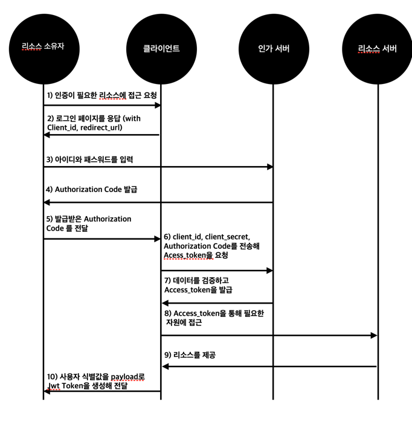
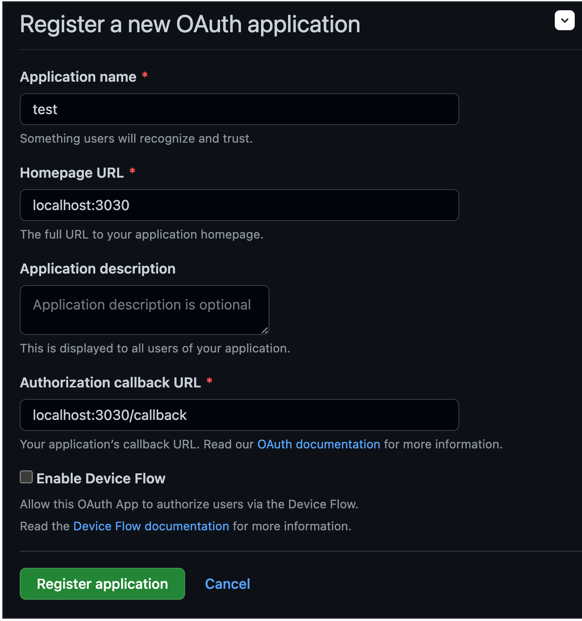
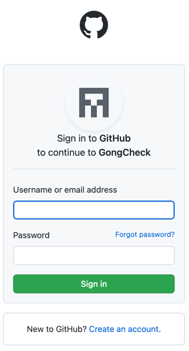
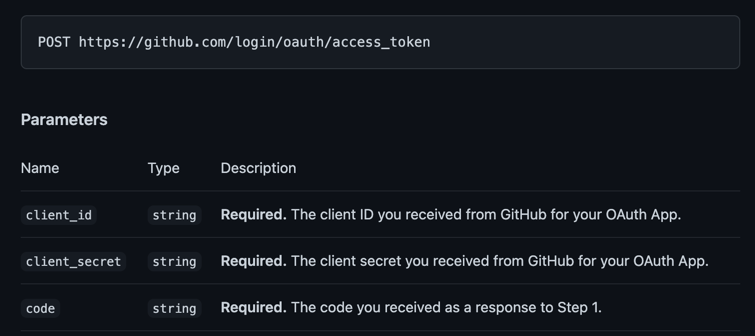
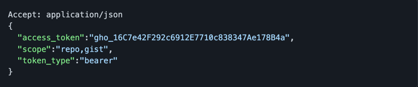

안녕하세요. 공책 팀 백엔드 팀원 찬입니다!

저희 공책팀에선 회원가입 & 로그인 기능을 Github OAuth를 활용해 구현해보았는데요.

간단한 OAuth 소개와 흐름을 글로 남겨보고자 합니다.

## OAuth란?

---
회원가입 혹은 로그인 하실 때 아래와 같은 버튼을 통해 진행하신 경험이 있으신가요?

아마 다들 경험 해보셨을거라고 생각합니다.

그렇다면 여러분들은 이미 OAuth를 사용하고 있습니다!


OAuth 2.0 공식 문서인 `RFC 6749`에는 다음과 같이 OAuth를 정의하고 있습니다.

> The OAuth 2.0 authorization framework enables a third-party application to obtain limited access to an HTTP service,
> either on behalf of a resource owner by orchestrating an approval interaction between the resource owner and the HTTP
> service, or by allowing the third-party application to obtain access on its own behalf. This specification replaces
> and obsoletes the OAuth 1.0 protocol described in RFC 5849.

OAuth 2.0 인가 프레임워크는 리소스 소유자와 HTTP 사이의 승인을 통해 사용자를 대신하여 혹은 제3의 애플리케이션이 자기 자신을 대신하여 접근을 얻도록 하여 제3의 애플리케이션이 HTTP 서비스에 대한
제한된 접근을 얻을 수 있도록 하는 표준 프로토콜이라고 소개하고 있습니다.

`주의 : 이 글은 OAuth2.0 기준으로 작성되었으며, RFC 5849에 기술된 OAuth1.0은 대체되었으며 사용하지 않는 상태입니다.`

## OAuth가 정의하는 역할

---

OAuth의 흐름을 알아보기 전에 OAuth가 정의하는 역할부터 알아보겠습니다.

OAuth는 총 4개의 역할을 정의하고 있는데 다음과 같습니다.

### 1. 리소스 소유자 (Resource Owner)

- 제한된 리소스에 대해 접근 요청을 할 수 있는 사용자 입니다. 쉽게 말해 카카오, 구글과 같은 외부 플랫폼의 리소스를 소유하고 있는 사용자입니다.

### 2. 리소스 서버 (Resource Server)

- 제한된 리소스를 호스팅하는 서버로써 Access Token을 사용해 제한된 리소스에 대한 요청을 받고 응답합니다.

### 3. 클라이언트 (Client)

- 인가를 이용해 리소스 소유자를 대신하여 제한된 리소스에 대한 요청을 만드는 애플리케이션입니다.

### 4. 인가 서버 (Authorization Server)

- 리소스 소유자를 성공적으로 인증하고 인가를 얻어 클라이언트에게 Access Token을 발급하는 서버입니다.

## OAuth 흐름

--- 

OAuth의 흐름은 앞서 정의한 4개의 역할의 상호작용으로 이루어집니다.

아래는 타임라인 순으로 정리한 대략적인 OAuth의 인증 흐름입니다.



편하게만 사용했던 OAuth 뒤로 수많은 상호작용이 이뤄지고 있다는 것을 알 수 있습니다.

너무 복잡하다 보니 아직 위의 흐름만 봐선 OAuth의 인증 흐름이 와닿지 않으실 수 있습니다. (제가 그랬습니다..)

저희 프로젝트에서 구현한 Github Oauth를 통한 구체적인 예시를 들어보겠습니다.

## Github OAuth

---

### 인증에 앞서...

Github OAuth 뿐만 아니라 다른 플랫폼을 이용하더라도 먼저 클라이언트를 리소스 서버에 등록해야 합니다.

Github에선 Setting -> Developer Settings -> OAuth Apps에 가시면 리소스 서버에 등록할 수 있습니다.



이 때, CallBack Url을 등록해야 하는데요. CallBack Url이란 리소스 소유자가 인증을 마치고 사용자를 redirection 시킬 url을 의미합니다. 인증이 성공하면 Authorization
Code를 발급해 주는데 이를 redirection하는 url로 발급합니다.

등록을 완료하셨다면 Github에서 Client_id와 Client_secret을 발급합니다. 이 데이터는 클라이언트가 추후에 인가 서버에 Access_token을 요청할 때 사용됩니다.

> 주의 : 절대로 Client_secret은 유출되어선 안됩니다.

### 1. 리소스 소유자의 로그인 요청

리소스 소유자가 저희가 만든 서비스(공책) 에서 Github 로그인을 요청합니다. 저희는 이를 Github의 인가 서버로 보내줘야 합니다.

Github의 인가 서버의 url은 `https://github.com/login/oauth/authorize` 입니다.

이때, 추가적으로 인가 서버에 여러 정보를 쿼리 스트링에 담아 보내는데요. 보통 아래에 기술한 정보를 같이 보냅니다.

- `client_id` : OAuth App에 등록할 때 발급받은 client_id를 의미합니다.
- `redirect_url` : OAuth App에 등록할 때 등록한 CallBack url을 의미합니다.
- `scope` : 클라이언트가 부여받은 리소스 접근 권한

### 2. 로그인 페이지 응답 & 아이디, 패스워드 입력

로그인 요청이 성공적으로 인가 서버에 도달한다면, 다음과 같은 로그인 페이지를 응답합니다.



리소스 소유자는 본인의 Github 아이디와 패스워드를 입력합니다.

### 3. Authorization Code 발급

리소스 소유자가 올바른 아이디와 패스워드를 입력했다면 인가 서버는 처음 저희가 Oauth Apps에 등록한 CallBack Url로 소유자를 redirection 시킵니다. 이 때, 깃허브는 쿼리 스트링에
Authorization Code를 발급합니다.

저는 CallBack url을 `localhost:3030/callback` 으로 설정했으니 다음과 같은 Url로 redirection 될 것입니다.

` http://localhost:3030/callback?code=24b7163439c514cdf123`

### 4. Access Token 요청

클라이언트는 발급받은 Authorization Code를 client_id, client_secret과 함께 전달해 Access Token을 요청합니다.

Github에서 제공하는 Access Token 발급 api의 형식은 아래와 같습니다.



클라이언트(공책)에선 다음과 같은 HTTP 요청을 통해 Access Token을 요청할 것입니다.

```
POST https://github.com/login/oauth/access_token

{
    "client_id" : "공책 client_id",
    "client_secret" : "공책 client_secret",
    "code" : "code" 
}
```

올바른 데이터를 보냈다면 Acess Token을 발급할 것입니다.

HTTP 응답 형식은 다음과 같습니다.



### 5. Github Profile 요청

발급받은 Access Token을 통해 클라이언트(공책)는 Github에게 리소스 소유자의 Github Profile을 요청할 것입니다.

Github에서 제공하는 사용자 Profile api의 형식은 아래와 같습니다.

`GET https://api.github.com/user`

클라이언트(공책)에선 다음과 같은 HTTP 요청을 통해 Access Token을 요청할 것입니다. 이 때 Authorization 헤더에 발급받은 토큰을 담아 보냅니다.

```
GET https://api.github.com/user

Authorization : Bearer "access_token"
```

올바른 Access Token 이라면 Github는 사용자 Profile을 응답합니다.

### 6. Jwt Token 발급

클라이언트(공책)에선 payload에 사용자 식별값을 넣어 Jwt Token을 생성해 전달합니다.

```
Accept: application/json
{
    "token" : "jwt.token.here"
}
```

---

## 마무리

이번 공책 프로젝트를 통해 처음으로 OAuth 인증 과정을 구현해 보았는데요. 생각보다 구현할 양이 많아 굉장히 놀랐습니다. 외부 API를 사용하기 때문에 테스트 작성에 대한 고민도 많았습니다. 글이 꽤 길지만
처음으로 OAuth를 접하시는 분이라면 이 글이 도움이 됐으면 좋겠습니다. 저에게 OAuth 인증 과정을 믿고 맡겨준 공책 팀원들 너무 감사합니다!

---

### References

- https://datatracker.ietf.org/doc/html/rfc6749
- https://docs.github.com/en/developers/apps/building-oauth-apps/scopes-for-oauth-apps
- https://docs.github.com/en/rest/users/users#get-a-user
- https://jaeseo.tistory.com/entry/OAuth-20-%EC%9D%B8%EC%A6%9D-%EA%B3%BC%EC%A0%95
