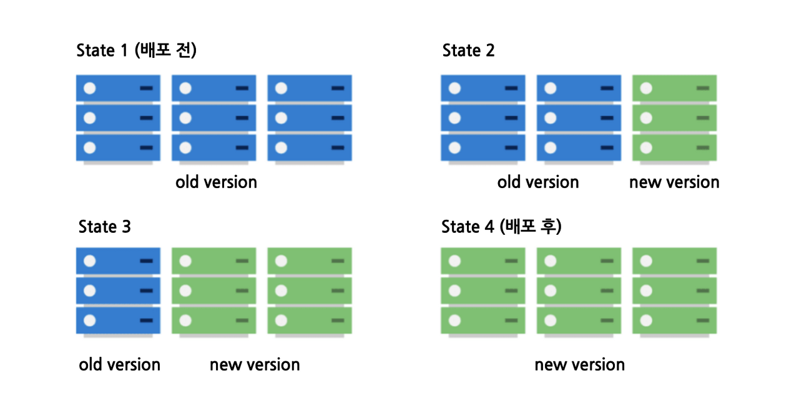
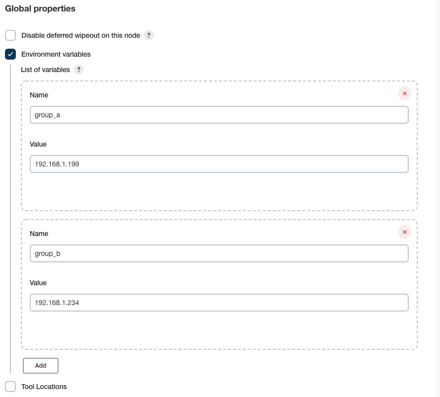

## 무중단 배포란?

---

서비스를 운영할 때 새로운 버전을 배포하는 동안 운영중인 애플리케이션이 종료되는 문제가 있다.

이런 문제는 사용자에게 안 좋은 경험을 제공하기 때문에 서비스가 정지되지 않고 배포할 수 있는 환경을 구성하기 위한 여러 전략이 존재한다.

### 무중단 배포 전략

- Rolling Update
- Blue-Green Deployment
- Canary Release

## Rolling Update

---



롤링 전략은 사용중인 인스턴스 내에서 새 버전을 교체하는 가장 기본적인 전략이다. 서비스중인 인스턴스 하나를 로드밸런서에서 라우팅하지 않도록 한 뒤 새 버전을 적용하여 다시 라우팅하는 전략으로 모든 인스턴스를
순차적으로 새로운 버전으로 교체하는 전략이다.

### 장점

- 롤링 전략은 구성된 자원을 그대로 유지한 채로 무중단 배포가 가능하기에 관리가 편하다.
- 인스턴스마다 차례로 배포를 진행하기 때문에 상황에 따라 손쉽게 롤백이 가능하다.

### 단점

- 롤링 전략은 인스턴스가 제한적일 경우에 사용되며 새 버전을 배포할 때 기존 트래픽을 감당하던 인스턴스 수가 감소하기 때문에 서비스 처리 용량을 고려해야 한다.
- 배포가 진행되는 동안 구버전과 신버전이 공존하기 때문에 호환성 문제가 발생할 수 있다.

## Blue-Green Deployment

---


운영 환경에서 구 버전과 동일하게 신 버전을 배포하고 일제히 전환하여 모든 트래픽을 신 버전으로 전환하는 전략이다. 블루 그린 전략은 물리적인 서버를 대상으로 사용하기에는 비용상 버겁다. 그래서 클라우드 환경에서
쉽게 인스턴스를 생성하거나 없앨 수 있는 AWS 나 Docker 와 같은 가상 환경에서 사용하는 것이 효과적이다.

### 장점

- 롤링 전략과 마찬가지로 빠른 롤백이 가능하다.
- 구버전과 동일한 환경에서 신버전 인스턴스를 구성하기 때문에 실제 서비스 환경에서 신버전을 미리 테스트할 수 있다.
- 배포가 완료된 후 남아있는 구버전 환경을 다음 배포에 재사용 할 수 있다.
- 신버전 배포가 진행되는 동안 서버 과부화가 일어날 확률이 적다.

## Canary Release

---


`카나리아` 라는 새는 유독가스에 굉장히 민감한 동물이다. 과거 광부들은 유독가스에 민감한 카나리아 새를 유독가스 누출의 위험을 감지하는 용도로 사용하였다.

카나리 전략은 위험을 빠르게 감지할 수 있는 배포 전략이다. 신버전의 제공 범위를 늘려가면서 모니터링 및 피드백 과정을 거칠 수 있다. 로드밸런서를 통해 신버전의 제품을 경험하는 사용자를 조절할 수 있는 것이
특징으로 신버전을 특정 사용자 혹은 단순 비율에 따라 구분해 제공할 수 있다. 이렇게 서버의 트래픽 일부를 신버전으로 분산하여 오류 여부를 확인할 수 있다.

### 장점

- 블루 그린 전략과 마찬가지로 신배포 전에 실제 운영 환경에서 미리 테스트할 수 있다.
- 카나리 배포는 단계적인 전환 방식을 통해 부정적 영향을 최소화하고 상황에 따라 트래픽 양을 늘리거나 롤백할 수 있다.

### 단점

- 롤링 전략과 마찬가지로 구버전과 신버전이 모두 운영되기 때문에 버전 관리가 필요하다.

## 사전 준비

---

### 전략 구성

무중단 배포를 구현하기 위해 위 전략 중 하나를 선택해야 했고 공책 프로젝트에선 블루 그린 전략을 선택했는데 그 이유는 다음과 같다.

1. EC2 인스턴스를 여유롭게 사용할 수 있는 환경에선 블루 그린 전략이 적합할 것이라 판단
2. 사용중인 EC2 인스턴스가 두 개의 스프링 프로젝트를 동시에 구동하기엔 오버헤드가 클 것이라 판단

블루 그린 전략 중 하나의 EC2 인스턴스 내부에서 두 개의 스프링 프로젝트를 구동하여 포트 스위칭을 통해 블루 그린 전략을 구현하는 방법이 있는데 2번 이유 때문에 EC2 인스턴스를 늘려 IP 스위칭을 통한 블루
그린 전략을 구현하기로 했다.

### 블루 그린 전략 시나리오

1. 인스턴스들을 `group_a` 와 `group_b` 로 구성
2. 구동중인 `group` 을 확인
3. `group_a` 가 구동중이라면 `group_a` 는 `blue` 로 `group_b` 는 `green` 으로 설정
4. `green` 그룹에 신버전 배포 후 실행
5. `green` 그룹에 대한 Health Check 진행
6. `Nginx` Reverse Proxy 설정을 `green` 그룹으로 전환
7. `blue` 그룹 서버를 모두 종료

### Global properties 설정



`group_a` 와 `group_b` 로 구분할 WAS 의 IP 를 명시해주기 위해 Global properties 를 설정해주어야 한다.

Manage Jenkins → Configure System → Global properties 에서 설정할 수 있다.

명시된 IP 들과 SSH 통신이 이루어져야하기 때문에 Publish over SSH 항목에 모두 등록되어 있어야 한다.

## Pipeline 코드

---

```groovy
pipeline {
    agent any

    stages {
        stage('git clone') {
            steps {
                checkout([$class: 'GitSCM', branches: [[name: '*/dev']], extensions: [[$class: 'SubmoduleOption', disableSubmodules: false, parentCredentials: true, recursiveSubmodules: false, reference: '', trackingSubmodules: true]], userRemoteConfigs: [[credentialsId: 'github-webhook-access-token', url: 'https://github.com/woowacourse-teams/2022-gong-check']]])
            }
        }

        stage('build') {
            steps {
                dir('backend') {
                    sh '''
                        echo '=== start application bootJar ==='
                        ./gradlew clean bootJar
                    '''
                }
            }
        }

        stage('publish ssh to server') {
            environment {
                GROUP_GREEN = sh(returnStdout: true, script: '''#!/bin/bash
                    group_a_array=($group_a)
                    alive_was_count=0
                    for i in "${group_a_array[@]}"
	                      do
		                        if curl -I -X OPTIONS "http://${i}:8080"; then
			                          alive_was_count=$((alive_was_count+1))
		                        fi
	                      done
                    if [ ${alive_was_count} -eq 0 ];then
                        echo 'group_a'
                    elif [ ${alive_was_count} -eq ${#group_a_array[@]} ];then
                        echo 'group_b'
                    else
                        echo 'currently runnig was counts are not correct'
                        exit 100
                    fi''').trim()
            }

            steps {
                dir('backend') {
                    script {
                        def green_ips;
                        def blue_ips;
                        def envVar = env.getEnvironment();
                        if ("group_a" == GROUP_GREEN) {
                            green_ips = envVar.group_a.split(' ');
                            blue_ips = envVar.group_b.split(' ');
                        } else {
                            green_ips = envVar.group_b.split(' ');
                            blue_ips = envVar.group_a.split(' ');
                        }
                        def green_ips_inline = green_ips.join(' ');
                        def map = parseSSHServerConfiguration();

                        for (item in green_ips) {
                            sshPublisher(publishers: [sshPublisherDesc(configName: map.get(item), transfers: [sshTransfer(cleanRemote: false, excludes: '', execCommand: 'sh /home/ubuntu/script/server_start.sh', execTimeout: 120000, flatten: false, makeEmptyDirs: false, noDefaultExcludes: false, patternSeparator: '[, ]+', remoteDirectory: '/deploy', remoteDirectorySDF: false, removePrefix: 'build/libs', sourceFiles: 'build/libs/*.jar')], usePromotionTimestamp: false, useWorkspaceInPromotion: false, verbose: true)])
                        }

                        sh '''#!/bin/bash
												    array=(''' + green_ips_inline + ''')
												
												    for ip in "${array[@]}"
																do
																    url=${array[0]}
																    attempts=10
																    timeout=10
																    online=false
																
																    echo "Checking status of $url."
																
																    for (( i=1; i<=$attempts; i++ ))
																		    do
																		        code=$(curl -sL --connect-timeout 20 --max-time 30 -w "%{http_code}\\n" "$url:8080" -o /dev/null)
																		
																		        if [ "$code" = "200" ]; then
																		            online=true
																		            echo "Connection successful."
																		            break
																		        else
																		            sleep $timeout
																		            echo "Connection failed."
																		        fi
																		    done
																
																    if $online; then
																        echo "Monitor finished, website is online."
																        exit 0 # Build Success
																    else
																        echo "Monitor failed, website seems to be down."
																        exit 1 # Build Failed
																    fi
																done
												'''

                        sshPublisher(publishers: [sshPublisherDesc(configName: 'gongcheck-reverse-proxy-dev', transfers: [sshTransfer(cleanRemote: false, excludes: '', execCommand: '''#!/bin/bash
		                        function parse_was_address() {
		                            array=(''' + green_ips_inline + ''')
		                            str=""
		                        	  for i in "${array[@]}"
		                                do
		                        	          str+="set \$service_url http://${i}:8080;\n"
		                                done
		                            echo -e "$str"
		                        }
		                        echo -e "$(parse_was_address)" | sudo tee /etc/nginx/conf.d/service-url.inc
		                        sudo service nginx reload
		                        ''', execTimeout: 120000, flatten: false, makeEmptyDirs: false, noDefaultExcludes: false, patternSeparator: '[, ]+', remoteDirectory: '/', remoteDirectorySDF: false, removePrefix: '', sourceFiles: '')], usePromotionTimestamp: false, useWorkspaceInPromotion: false, verbose: false)])

                        for (item in blue_ips) {
                            sshPublisher(publishers: [sshPublisherDesc(configName: map.get(item), transfers: [sshTransfer(cleanRemote: false, excludes: '', execCommand: 'sh /home/ubuntu/script/kill.sh', execTimeout: 120000, flatten: false, makeEmptyDirs: false, noDefaultExcludes: false, patternSeparator: '[, ]+', remoteDirectory: '/deploy', remoteDirectorySDF: false, removePrefix: 'build/libs', sourceFiles: 'build/libs/*.jar')], usePromotionTimestamp: false, useWorkspaceInPromotion: false, verbose: true)])
                        }
                    }
                }
            }
        }

        stage('clean up workspace') {
            steps {
                cleanWs deleteDirs: true
            }
        }
    }

    post {
        success {
            slackSend(channel: 'jenkins', color: '#00FF00', message: "SUCCESSFUL: Job '${env.JOB_NAME} [${env.BUILD_NUMBER}]' (${env.BUILD_URL})")
        }
        failure {
            slackSend(channel: 'jenkins', color: '#FF0000', message: "FAILED: Job '${env.JOB_NAME} [${env.BUILD_NUMBER}]' (${env.BUILD_URL})")
        }
    }
}

@NonCPS
def parseSSHServerConfiguration() {
    def xml = new XmlSlurper().parse("${JENKINS_HOME}/jenkins.plugins.publish_over_ssh.BapSshPublisherPlugin.xml");
    def server_nick_names = xml.'**'.findAll { it.name() == 'name' };
    def server_ip_address = xml.'**'.findAll { it.name() == 'hostname' };
    def map = new HashMap();
    for (i = 0; i < server_nick_names.size(); i++) {
        def server_ip_str = (String) server_ip_address.get(i);
        def server_nick_name_str = (String) server_nick_names.get(i);
        map.put(server_ip_str, server_nick_name_str);
    }
    println(map);
    return map;
}
```

### 블루 그린 그룹 구분

```groovy
environment {
    GROUP_GREEN = sh(returnStdout: true, script: '''#!/bin/bash
        group_a_array=($group_a)
        alive_was_count=0
        for i in "${group_a_array[@]}"
            do
                if curl -I -X OPTIONS "http://${i}:8080"; then
                    alive_was_count=$((alive_was_count+1))
                fi
            done
        if [ ${alive_was_count} -eq 0 ];then
            echo 'group_a'
        elif [ ${alive_was_count} -eq ${#group_a_array[@]} ];then
            echo 'group_b'
        else
            echo 'currently runnig was counts are not correct'
            exit 100
        fi''').trim()
}
```

Global properties 설정을 통해 `group_a` `group_b` 변수를 사용할 수 있다. `group_a` 배열을 순회하면서 `OPTIONS` 요청을 보내 해당 그룹에 속한 서버들이 구동중인지 확인할
수 있다.

`environment` 블럭을 통해 쉘 스크립트에서 반환한 값을 환경 변수에 담아서 외부 Groovy 스크립트에서 사용할 수 있다.

`group_a` 에 속한 서버들이 구동중이라면 `GROUP_GREEN` 에는 `group_a` 라는 문자열이 저장된다.

### 그룹별 IP 배열 생성

```groovy
def green_ips;
def blue_ips;
def envVar = env.getEnvironment();
if ("group_a" == GROUP_GREEN) {
    green_ips = envVar.group_a.split(' ');
    blue_ips = envVar.group_b.split(' ');
} else {
    green_ips = envVar.group_b.split(' ');
    blue_ips = envVar.group_a.split(' ');
}
```

`env.getEnvironment()` 메서드를 통해 Global properties 에서 선언한 환경 변수를 Groovy 스크립트에서 사용할 수 있다.

`environment` 블럭에서 선언한 `GROUP_GREEN` 을 통해 `green_ips` 와 `blue_ips` 를 구분한다.

`group_a` 가 `green` 이라면 `green_ips` 에는 `192.168.1.199` 가 할당되었을 것이다.

### IP 에 해당하는 SSH Server Name Map 생성

```groovy
@NonCPS
def parseSSHServerConfiguration() {
    def xml = new XmlSlurper().parse("${JENKINS_HOME}/jenkins.plugins.publish_over_ssh.BapSshPublisherPlugin.xml");
    def server_nick_names = xml.'**'.findAll { it.name() == 'name' };
    def server_ip_address = xml.'**'.findAll { it.name() == 'hostname' };
    def map = new HashMap();
    for (i = 0; i < server_nick_names.size(); i++) {
        def server_ip_str = (String) server_ip_address.get(i);
        def server_nick_name_str = (String) server_nick_names.get(i);
        map.put(server_ip_str, server_nick_name_str);
    }
    println(map);
    return map;
}
```

Jenkins 의 `sshPublisher` 는 IP 가 아닌 SSH Server Name 으로 작업을 수행하기 때문에 IP 에 해당하는 SSH Server Name 을 알아내야 한다.

Jenkins 는 Publish over SSH 항목에서 설정했던 SSH Server Name 과 IP 등의
정보를 `${JENKINS_HOME}/jenkins.plugins.publish_over_ssh.BapSshPublisherPlugin.xml` 에 저장한다.

위 파일을 파싱하여 IP 와 SSH Server Name 이 `key-value` 형태로 이루어진 Map 을 생성해 스크립트에서 활용할 필요가 있다.

Jenkins 는 기본적으로 작업 중지 및 재개 등을 위해 스크립트의 `step` 별 상태를 직렬화하여 저장하는데, XML 파싱 관련 객체들은 직렬화가 불가능하여 에러가 발생한다.

때문에 XML 파싱 관련 로직을 별도의 메서드로 분리하여 `@NonCPS` 애너테이션을 통해 직렬화 및 저장 대상에서 제외시킨다.

```groovy
{
    192.168 .1 .218 = gongcheck - frontend - dev ,
    192.168 .1 .247 = gongcheck - frontend - prod ,
    192.168 .1 .220 = gongcheck - image - prod ,
    192.168 .1 .199 = gongcheck - backend - dev - a ,
    192.168 .1 .234 = gongcheck - backend - dev - b ,
    192.168 .1 .201 = gongcheck - backend - prod ,
    192.168 .1 .212 = gongcheck - image - dev ,
    192.168 .1 .240 = gongcheck - reverse - proxy - dev
}
```

파싱된 Map 을 확인해보면 위와 같이 IP 에 해당하는 SSH Server Name 을 가져올 수 있도록 생성되어 있다.

### Green 그룹 배포 및 WAS 실행

```groovy
for (item in green_ips) {
    sshPublisher(publishers: [sshPublisherDesc(configName: map.get(item), transfers: [sshTransfer(cleanRemote: false, excludes: '', execCommand: 'sh /home/ubuntu/script/server_start.sh', execTimeout: 120000, flatten: false, makeEmptyDirs: false, noDefaultExcludes: false, patternSeparator: '[, ]+', remoteDirectory: '/deploy', remoteDirectorySDF: false, removePrefix: 'build/libs', sourceFiles: 'build/libs/*.jar')], usePromotionTimestamp: false, useWorkspaceInPromotion: false, verbose: true)])
}
```

`green_ips` 배열을 순회하면서 `map.get(item)` 을 통해 IP 에 해당하는 SSH Server Name 을 통해 `sshPublisher` 를 실행할 수 있다.

`green_ips` 에 `192.168.1.199` 가 들어있다면, `map.get(item)` 을 통해 `gongcheck-backend-dev-a` 에 해당하는 WAS 로 `sshPublisher` 를 실행할
것이다.

```bash
echo "> 현재 진행중인 application pid 조회"
CURRENT_PID=$(ps -ef | grep java | grep jar | grep -v nohup | grep gong-check | awk '{print $2}')
echo "> 현재 진행중인 application pid : $CURRENT_PID"

if [ -z ${CURRENT_PID} ]; then
echo "> 현재 구동중인 어플리케이션이 없으므로 종료하지 않습니다."
else
echo "> sudo kill -9 $CURRENT_PID"
sudo kill -9 ${CURRENT_PID}
sleep 10
sudo lsof -i:8080
echo "> 어플리케이션 정상 종료 완료"
fi

echo "> 어플리케이션 배포 시작"
JAR_PATH=$(ls -t /home/ubuntu/deploy/*.jar | head -1)
BUILD_ID=dontKillMe sudo nohup java -jar ${JAR_PATH} --spring.profiles.active=dev  2>> /dev/null >> /dev/null &
echo "> 어플리케이션 배포 종료"
```

`sshPublisher` 는 인스턴스 내부에 있는 `server_start.sh` 를 실행시키는데, 이는 위와 같다.

### Green 그룹 Health Check

```groovy
sh '''#!/bin/bash
    array=(''' + green_ips_inline + ''')

    for ip in "${array[@]}"
				do
				    url=${array[0]}
				    attempts=10
				    timeout=10
				    online=false
				
				    echo "Checking status of $url."
				
				    for (( i=1; i<=$attempts; i++ ))
						    do
						        code=$(curl -sL --connect-timeout 20 --max-time 30 -w "%{http_code}\\n" "$url:8080" -o /dev/null)
						
						        if [ "$code" = "200" ]; then
						            online=true
						            echo "Connection successful."
						            break
						        else
						            sleep $timeout
						            echo "Connection failed."
						        fi
						    done
				
				    if $online; then
				        echo "Monitor finished, website is online."
				        exit 0 # Build Success
				    else
				        echo "Monitor failed, website seems to be down."
				        exit 1 # Build Failed
				    fi
				done
'''
```

쉘 스크립트를 통해 `green` 그룹에 대한 Health Check 를 진행한다. `curl` 요청을 통해 해당 IP 의 8080번 포트가 열려있는지 확인한다. 10번의 시도 간 서버가 응답하지 못한다면 서버
배포에 실패했다고 판단하고 스크립트를 종료한다.

### Nginx 설정 변경

`green` 에 해당하는 WAS 가 준비가 되어 있으니 `Nginx` 에서 요청을 `green` 으로 보낼 수 있도록 설정을 변경해주어야 한다.

```bash
server {
	server_name dev.gongcheck.shop;

	include /etc/nginx/conf.d/service-url.inc;

	location / {
		proxy_pass $service_url/index.html;
	}

	# ...
}
```

현재 `Nginx` 에선 `proxy_pass` 에 `service_url` 이라는 변수를 할당하고 있다.

```groovy
sshPublisher(publishers: [sshPublisherDesc(configName: 'gongcheck-reverse-proxy-dev', transfers: [sshTransfer(cleanRemote: false, excludes: '', execCommand: '''#!/bin/bash
    function parse_was_address() {
        array=(''' + green_ips_inline + ''')
        str=""
    	  for i in "${array[@]}"
            do
    	          str+="set \$service_url http://${i}:8080;\n"
            done
        echo -e "$str"
    }
    echo -e "$(parse_was_address)" | sudo tee /etc/nginx/conf.d/service-url.inc
    sudo service nginx reload
    ''', execTimeout: 120000, flatten: false, makeEmptyDirs: false, noDefaultExcludes: false, patternSeparator: '[, ]+', remoteDirectory: '/', remoteDirectorySDF: false, removePrefix: '', sourceFiles: '')], usePromotionTimestamp: false, useWorkspaceInPromotion: false, verbose: false)])
```

해당 변수는 `service-url.inc` 를 통해 선언되고 있기에 이를 수정하는 쉘 스크립트를 `sshPublisher` 를 통해 수행한다. `tee` 명령어를 통해 해당 파일을 덮어씌우거나 새로 생성할 수
있다.

```bash
set $service_url http://192.168.1.199:8080;
```

`green_ips_inline` 에 `192.168.1.199` 만 존재한다면, `service-url.inc` 파일에는 위와 같은 스크립트가 작성되어 있을 것이다.

### Blue 그룹 WAS 종료

```groovy
for (item in blue_ips) {
    sshPublisher(publishers: [sshPublisherDesc(configName: map.get(item), transfers: [sshTransfer(cleanRemote: false, excludes: '', execCommand: 'sh /home/ubuntu/script/kill.sh', execTimeout: 120000, flatten: false, makeEmptyDirs: false, noDefaultExcludes: false, patternSeparator: '[, ]+', remoteDirectory: '/deploy', remoteDirectorySDF: false, removePrefix: 'build/libs', sourceFiles: 'build/libs/*.jar')], usePromotionTimestamp: false, useWorkspaceInPromotion: false, verbose: true)])
}
```

`blue_ips` 배열을 순회하면서 `map.get(item)` 을 통해 IP 에 해당하는 SSH Server Name 을 통해 `sshPublisher` 를 실행할 수 있다.

`blue_ips` 에 `192.168.1.234` 가 들어있다면, `map.get(item)` 을 통해 `gongcheck-backend-dev-b` 에 해당하는 WAS 로 `sshPublisher` 를 실행할
것이다.

```bash
echo "> 현재 진행중인 application pid 조회"
CURRENT_PID=$(ps -ef | grep java | grep jar | grep -v nohup | grep gong-check | awk '{print $2}')
echo "> 현재 진행중인 application pid : $CURRENT_PID"

if [ -z ${CURRENT_PID} ]; then
echo "> 현재 구동중인 어플리케이션이 없으므로 종료하지 않습니다."
else
echo "> sudo kill -9 $CURRENT_PID"
sudo kill -9 ${CURRENT_PID}
sleep 10
sudo lsof -i:8080
echo "> 어플리케이션 정상 종료 완료"
fi
```

`sshPublisher` 는 인스턴스 내부에 있는 `kill.sh` 를 실행시키는데, 이는 위와 같다.

## 개선 사항

---

추후 WAS 를 다중화한다면 로드 밸런싱을 적용해야하기 때문에 `Nginx` 설정을 변경하는 스크립트를 수정해주어야 한다. 로드 밸런싱 설정 적용은 크게 어렵지 않기 때문에 추후에 서비스가 WAS 다중화를 요구한다면
그때 수정해주어도 무방하다.

추가로 `blue` 그룹에 해당하는 EC2 인스턴스가 `idle` 상태로 대기하고 있기 때문에 불필요한 비용이 발생하고 있는 것을 알 수 있다. 때문에 배포가 이루어질 때 마다 EC2 인스턴스를 자동으로 생성 및
제거해주는 방식을 고려해 볼 필요가 있다.

## References

---

- [https://loosie.tistory.com/781](https://loosie.tistory.com/781)
- [https://xlffm3.github.io/devops/mock-blue-green-cd/](https://xlffm3.github.io/devops/mock-blue-green-cd/)
- [https://jiyeonseo.github.io/2020/03/19/jenkins-health-check/](https://jiyeonseo.github.io/2020/03/19/jenkins-health-check/)