## 개요

---

안녕하세요 공책팀에서 백엔드 개발을 맡고 있는 쿼리치입니다.

2차 스프린트를 진행하면서 저희 공책 프로젝트에 새로운 기능들이 많이 추가될 예정인데요.

제가 이번에 추가하게된 기능은 Slack Bot 을 연동하여 제출 시 Slack 알림이 울리는 기능입니다.

### 메시지 봇을 만드는 방법

Slack 에서 제공하는 API 로 메시지 봇을 만드는 방법은 총 두 가지가 존재합니다.

1. `토큰` + `채널명` 으로 메시지를 보낸다.
2. Webhook URL 을 통해 메시지를 보낸다.

하나하나 방법을 알아보면서 두 가지의 차이점을 먼저 알아보겠습니다.

<br>

## 토큰 + 채널명으로 Slack Bot 연동하기

---

### 앱 생성하기

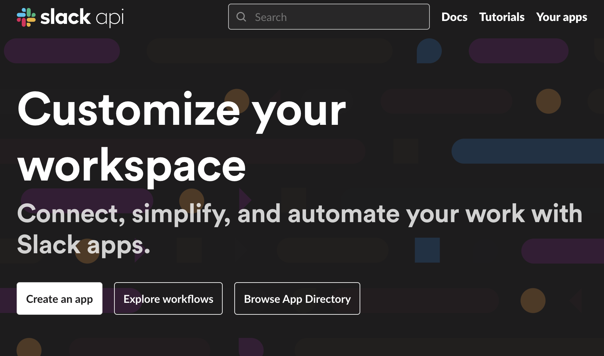

[Slack API 페이지](https://api.slack.com/) 접속 후 `Create an app` 을 클릭합니다.

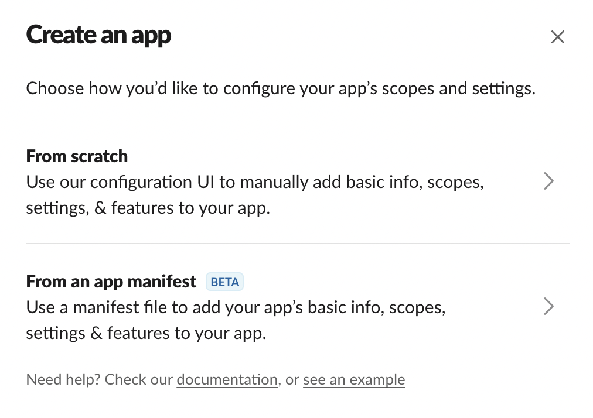

`From scratch` 를 눌러 새로운 앱을 만들어보겠습니다.

### 워크스페이스 지정

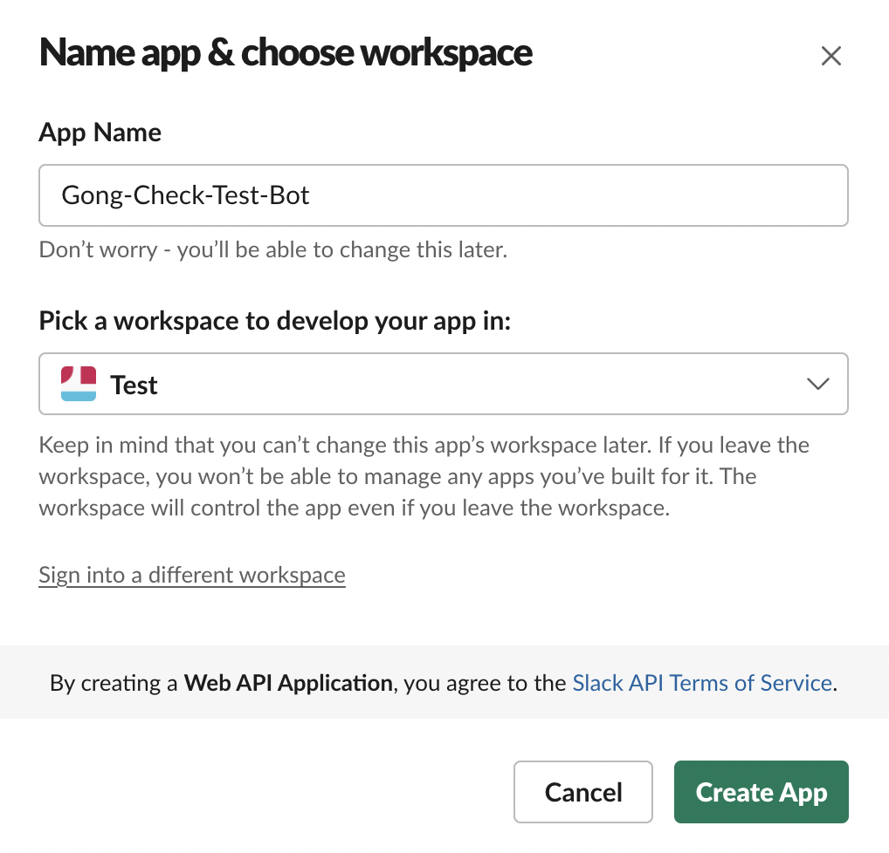

이름을 정하고 봇을 추가할 워크스페이스를 지정하겠습니다.

### 권한 설정

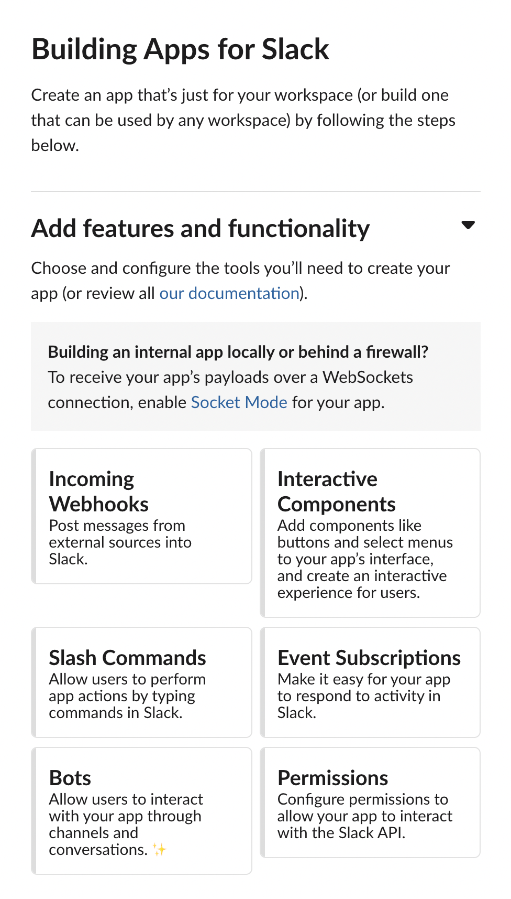

봇이 채널에 채팅을 남길 수 있도록 `Permissions` 에서 권한을 설정해주겠습니다.

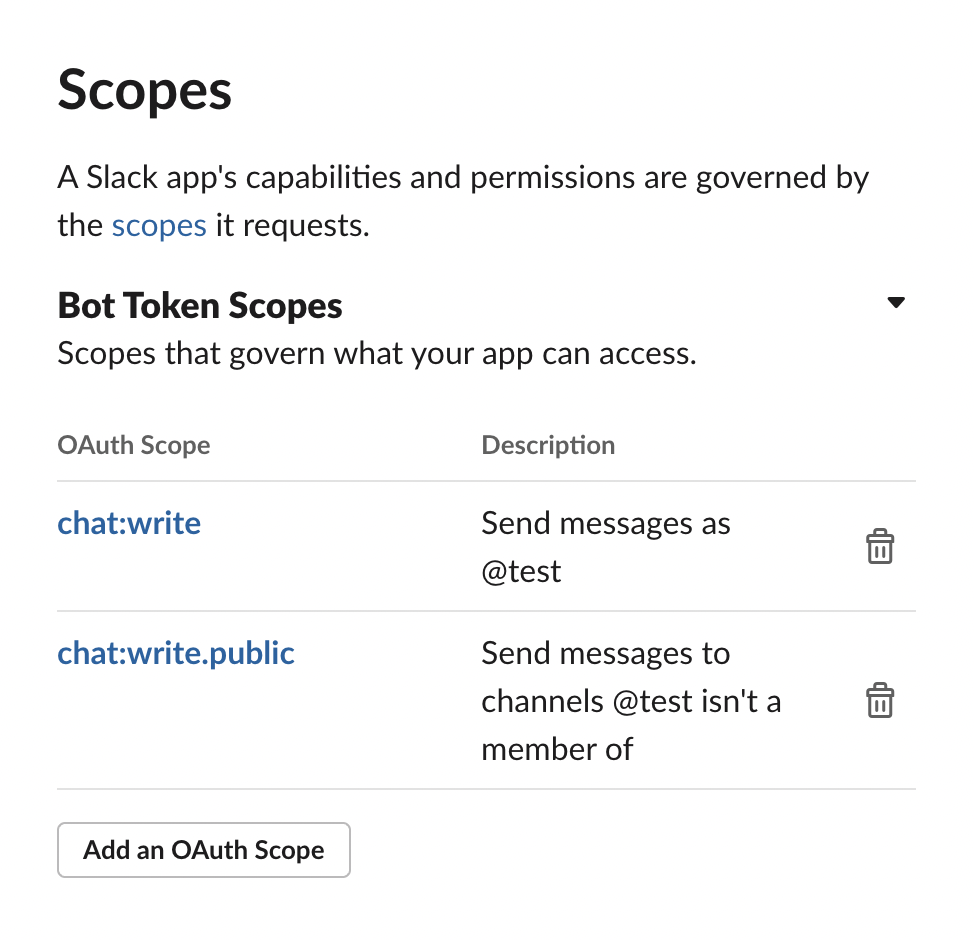

Scopes 설정에서 `chat:write` 와 `chat:write.public` 을 활성화해줍시다.

### 앱 설치

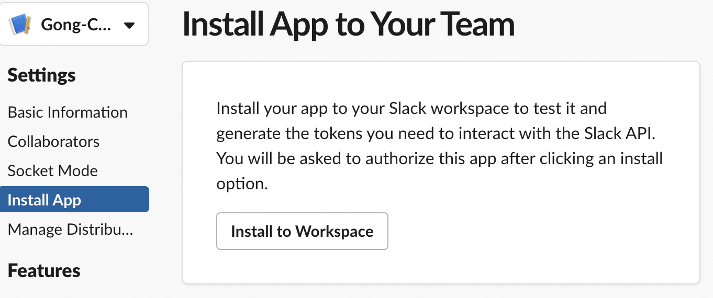

Install App 으로 이동 후 `Install to Workspace` 를 통해 워크스페이스에 앱을 설치해보겠습니다.

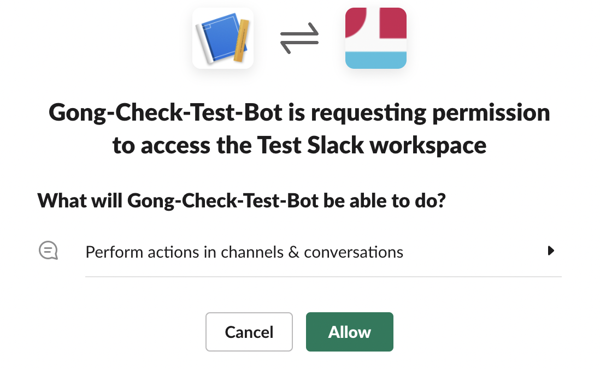

`Allow` 해줍시다.

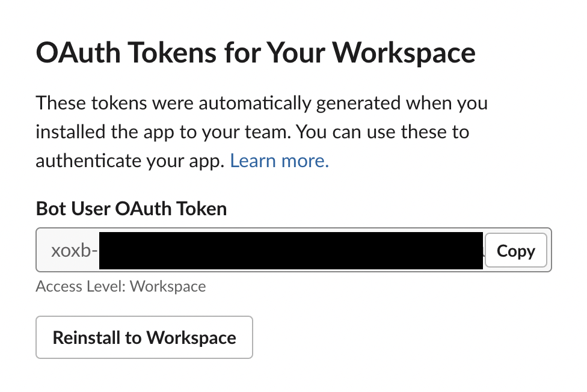

성공적으로 설치가 완료되면 `xoxb` 토큰을 발급 받으실 수 있습니다.

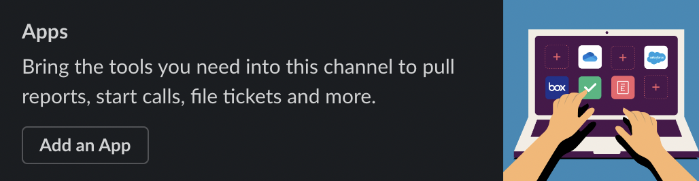

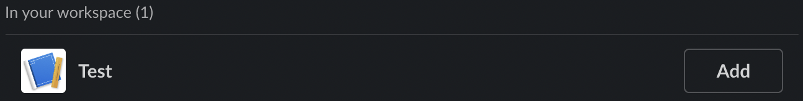

봇을 설치하고 싶은 채널에서 `Add an App` 클릭 후 만든 봇을 `Add` 해줍시다.

여기까지 완료했다면 토큰 + 채널명을 기반으로 한 봇 사용이 가능합니다.

<br>

## Webhook URL 을 통해 Slack Bot 연동하기

---

Webhook 의 경우 권한 설정까지는 동일하게 설정해주고 시작해줍니다.

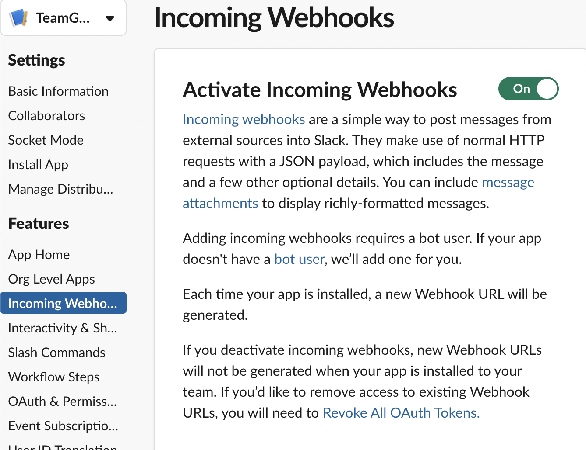

Incoming Webhooks 설정에 들어가 Activate 해줍시다.


Webhook 이 활성화되면 아래에 `Add New Webhook to Workspace` 를 눌러줍시다.

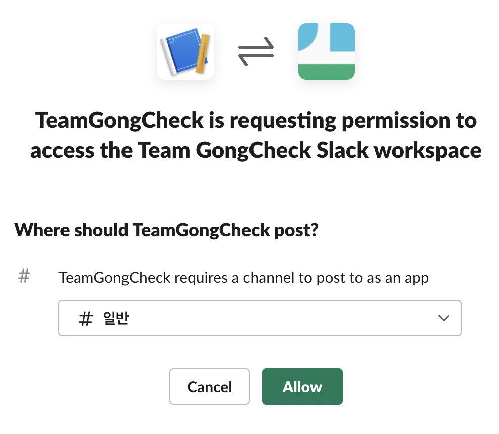

메시지 봇이 활동할 채널을 지정해줍시다.

`Allow` 를 누르면 해당 채널에 자동으로 App 이 설치됩니다.

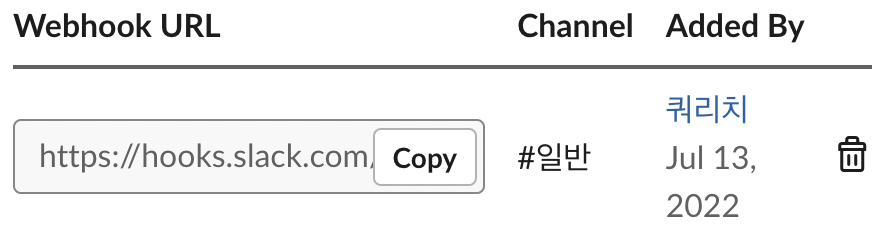

Webhook URL 이 생성되었습니다.

해당 URL 을 통해 메시지를 보내줄 수 있습니다.

<br>

## Spring Boot 프로젝트에 연동하기

---

### build.gradle

```java
implementation 'com.squareup.okhttp3:okhttp:4.10.0'
implementation 'com.slack.api:slack-app-backend:1.22.2'
implementation 'com.slack.api:slack-api-model:1.22.2'
```

Slack 에서 제공하는 API 를 활용하기 위해 의존성을 추가해줍니다.

첫번째 의존성은 Webhook 을 사용할 때 필요하기 때문에 토큰 기반을 사용한다면 필요없는 의존성입니다.

### 메시지 형식 커스텀하기

Slack API 에서는 메시지를 보낼 때 attachments 라는 필드를 통해 메시지를 JSON 형식으로 전송하고 있습니다.

[Slack 메시지 형식 페이지](https://api.slack.com/reference/messaging/attachments)에 들어가보면 메시지가 어떤 형식으로 보여지는지 확인해 볼 수 있습니다.

```java
public static Attachments of(final SubmissionResponse submissionResponse) {
    return new Attachments(List.of(Attachment.builder()
            .fallback("📝 체크리스트가 제출되었습니다.")
            .color("#99CCFF")
            .pretext("📝 체크리스트가 제출되었습니다.")
            .fields(List.of(
                    Field.builder().value("제출자명 : " + submissionResponse.getAuthor()).build(),
                    Field.builder().value("공간이름 : " + submissionResponse.getSpaceName()).build(),
                    Field.builder().value("작업이름 : " + submissionResponse.getJobName()).build()))
            .thumbUrl("https://d3ihz389yobwks.cloudfront.net/1597428501575899426169503000.jpg")
            .footer("제출시간")
            .ts(String.valueOf(Timestamp.valueOf(LocalDateTime.now()).getTime()))
            .build()));
}
```

Slack API 가 제공하는 `Attachment.builder()` 를 통해 원하는 형식의 메시지를 만들어봅시다.

### 토큰 + 채널명을 통해 메시지 전송

```java
public void sendMessageWithToken(final SubmissionResponse submissionResponse) {
    try {
        Slack slack = Slack.getInstance();
        slack.methods("TOKEN")
                .chatPostMessage(req -> req.channel("CHANNEL")
                        .attachments(Attachments.of(submissionResponse).getAttachments()));
    } catch (IOException | SlackApiException e) {
        throw new RuntimeException(e);
    }
}
```

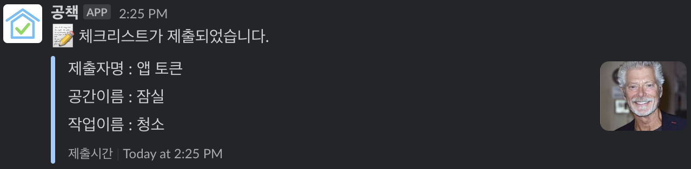

### 앱 Webhook URL 을 통해 메시지 전송

```java
public void sendMessageWithAppUrl(final SubmissionResponse submissionResponse) {
    try {
        Slack slack = Slack.getInstance();
        Payload payload = Payload.builder()
                .attachments(Attachments.of(submissionResponse).getAttachments())
                .build();
        slack.send("GONG_CHECK_APP_URL", payload);
    } catch (IOException e) {
        throw new RuntimeException(e);
    }
}
```


Slack App 을 만드는 과정이나 코드를 작성하는 과정을 보았을 때 두 방법 모두 큰 차이점은 없는 것 같습니다. 그렇다면 외부 사용자 입장에선 어떤 방식이 더 좋은 접근성을 가지고 있을까요?

<br>

## 외부인 입장으로 봇 연동해보기

---

외부인의 입장으로 생각해봅시다.

공책 서비스를 사용하고 슬랙으로 알림으로 받고 싶은데 Slack App 을 만드는 과정은 너무 복잡합니다.

간단히 슬랙에 봇만 추가하고 싶습니다.

뭔가 좋은 방법이 없을까요?


Slack 에선 `incoming-webhook` 이라는 앱을 제공하고 있습니다.

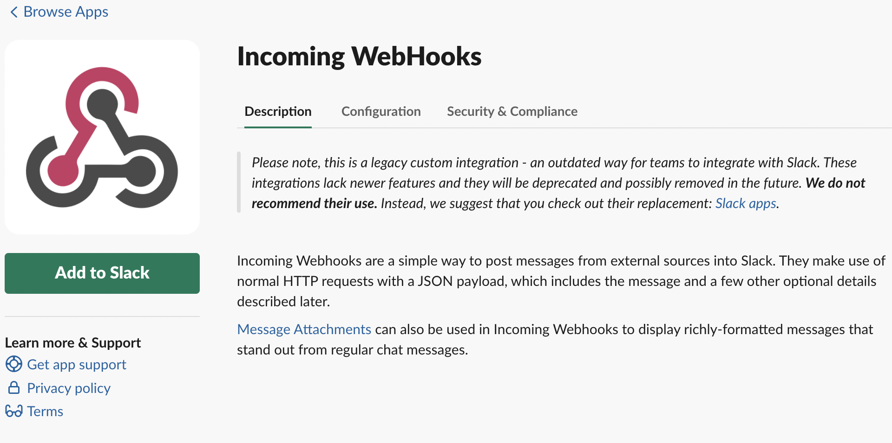

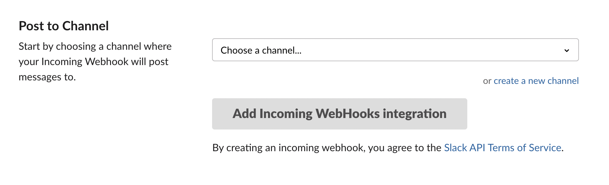

`Add to Slack` 버튼을 눌러 봇이 설치되길 원하는 채널을 지정해줍시다.


Webhook URL 이 생성되었습니다.

해당 URL 을 복사하여 공책 서비스에 기입해주면 슬랙 알림 기능을 활용할 수 있습니다.

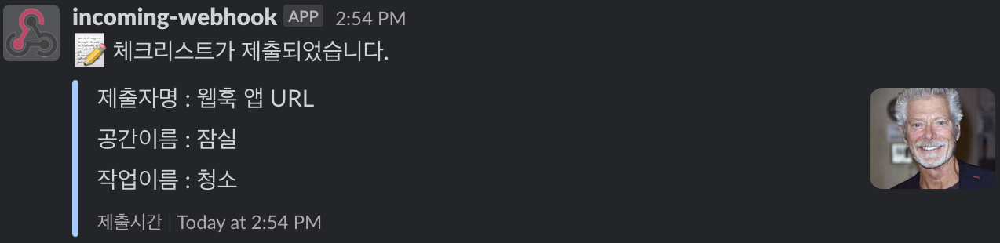

짠. 외부인 입장에서도 손쉽게 슬랙 알림 기능을 사용할 수 있게 되었습니다.

아무래도 토큰을 발급받고 권한을 설정해주는 작업보단 간단히 URL 만 기입해주는 것이 사용자 입장에선 더 간편할 것 같네요.

### Incoming Webhook 앱을 통한 Webhook URL 을 통해 메시지 전송

```java
public void sendMessageWithIncomingWebhookAppUrl(final SubmissionResponse submissionResponse) {
    try {
        Slack slack = Slack.getInstance();
        Payload payload = Payload.builder()
                .attachments(Attachments.of(submissionResponse).getAttachments())
                .build();
        slack.send("INCOMING_WEBHOOK_APP_URL", payload);
    } catch (IOException e) {
        throw new RuntimeException(e);
    }
}
```

코드 역시 Webhook URL 만 변경해주면 되기 때문에 사용자가 기입한 URL 을 가져와 사용할 수 있습니다.

<br>

## 외부 API 비동기 처리하기

---

현재 구조에선 Slack 에서 제공하는 API 를 활용해 요청을 보내고 있습니다.

외부 API 를 사용하는 것이기 때문에 해당 기능에 장애가 생겼을 경우를 따져봐야합니다.

```java
@PostMapping("/jobs/{jobId}/complete")
public ResponseEntity<Void> submitJobCompletion(@AuthenticationPrincipal final Long hostId,
                                                @PathVariable final Long jobId,
                                                @Valid @RequestBody final SubmissionRequest request) {
    SubmissionResponse submissionResponse = submissionService.submitJobCompletion(hostId, jobId, request);
    alertService.sendMessage(submissionResponse);
    return ResponseEntity.ok().build();
}
```

예를 들어, `alertService.sendMessage(submissionResponse)` 메서드가 정상적으로 작동하지 않아 무제한으로 대기하게 된다면, 해당 `Controller` 는 응답을 보내줄 수 없게됩니다.

이를 방지하기 위해 우린 비동기 처리를 고려해볼 수 있습니다.

다양한 비동기 처리 방식 중에 현재 스프린트에선 스프링에서 제공하는 `@Aysnc` 사용하기로 했습니다.

### @Aysnc 적용

`@Aysnc` 를 적용하는 방법은 단순합니다.

```java
@SpringBootApplication
@EnableAsync
public class GongCheckApplication {

    public static void main(String[] args) {
        SpringApplication.run(GongCheckApplication.class, args);
    }
}
```

```java
@Override
@Async
public void sendMessage(final SubmissionResponse submissionResponse) {
    try (Slack slack = Slack.getInstance()) {
        Payload payload = Payload.builder()
                .attachments(Attachments.of(submissionResponse).getAttachments())
                .build();
        slack.send(submissionResponse.getSlackUrl(), payload);
    } catch (Exception e) {
        throw new RuntimeException(e);
    }
}
```

비동기 처리가 되길 바라는 메서드에 `@Aysnc` 를 적용하고 `@SpringBootApplication` 이 적용된 클래스에 `@EnableAsync` 를 적용하면 됩니다.

### AsyncConfigurerSupport

위와 같이 `@Async` 를 사용하면 단순하게 비동기 처리를 적용할 수 있지만 스레드를 관리할 수 없다는 단점이 존재합니다. 때문에 `AsyncConfigurerSupport` 를 상속받는 클래스를 작성하여 스레드를 관리해주도록 합시다.

```java
@Configuration
@EnableAsync
public class AsyncConfig extends AsyncConfigurerSupport {

    @Override
    public Executor getAsyncExecutor() {
        ThreadPoolTaskExecutor taskExecutor = new ThreadPoolTaskExecutor();
        taskExecutor.setCorePoolSize(3);
        taskExecutor.setMaxPoolSize(30);
        taskExecutor.setQueueCapacity(50);
        taskExecutor.initialize();
        return taskExecutor;
    }
}
```

- `CorePoolSize` 기본으로 실행 대기하는 Thread 의 수
- `MaxPoolSize` 동시 동작하는 최대 Thread 의 수
- `QueueCapacity` MaxPoolSize 초과 요청을 저장할 수 있는 Queue 의 수

### 주의사항

`@Async` 를 사용하기 위해선 주의해야할 점이 몇가지 존재합니다.

- `public` 메서드에서만 사용 가능
- 자가 호출 불가능
- QueueCapacity 를 초과하는 비동기 메서드 호출 시 `TaskRejectedException` 발생

```java
@PostMapping("/jobs/{jobId}/complete")
public ResponseEntity<Void> submitJobCompletion(@AuthenticationPrincipal final Long hostId,
                                                @PathVariable final Long jobId,
                                                @Valid @RequestBody final SubmissionRequest request) {
    SubmissionResponse submissionResponse = submissionService.submitJobCompletion(hostId, jobId, request);
    try {
        alertService.sendMessage(submissionResponse);
    } catch (TaskRejectedException e) {
        throw new RuntimeException(e);
    }
    return ResponseEntity.ok().build();
}
```

저희에게 해당하는 사항은 `TaskRejectedException` 에 대한 방어 처리이기 때문에 해당 메서드를 사용하는 쪽에 방어 코드를 작성해주도록 하겠습니다.

<br>

## 결론

---

메시지 봇을 적용하는 두 가지 방법을 비교해본 결과 개발하는 입장에선 큰 차이를 느끼지 못했습니다.

하지만, 공책 앱이 public 하게 distribute 되는 것이 아닌 이상 외부인이 공책 앱을 설치하고 사용하는 것에 불편함이 있을 수 있다는 것을 생각해볼 수 있었습니다.

때문에, 외부인의 접근성을 고려했을 땐 Webhook URL 을 활용하는 것이 훨씬 더 간편하다는 것을 알 수 있었습니다.

또한, 외부 API 의 의존성을 최소화하기 위해 비동기 처리를 생각해볼 수 있었습니다.

<br>

## References

---

- [https://velog.io/@jimin3263/Spring-boot-Slack](https://velog.io/@jimin3263/Spring-boot-Slack)
- [https://vixxcode.tistory.com/188](https://vixxcode.tistory.com/188)
- [https://velog.io/@rudwnd33/springboot-slack](https://velog.io/@rudwnd33/springboot-slack)
- [https://leeborn.tistory.com/entry/Spring-Boot-슬랙-webhook-메시지-보내기](https://leeborn.tistory.com/entry/Spring-Boot-%EC%8A%AC%EB%9E%99-webhook-%EB%A9%94%EC%8B%9C%EC%A7%80-%EB%B3%B4%EB%82%B4%EA%B8%B0)
- [https://cheese10yun.github.io/slack-bot-spring/](https://cheese10yun.github.io/slack-bot-spring/)
- [https://slack.dev/java-slack-sdk/](https://slack.dev/java-slack-sdk/)
- [https://steady-coding.tistory.com/611](https://steady-coding.tistory.com/611)
- [https://velog.io/@gillog/Spring-Async-Annotation비동기-메소드-사용하기](https://velog.io/@gillog/Spring-Async-Annotation%EB%B9%84%EB%8F%99%EA%B8%B0-%EB%A9%94%EC%86%8C%EB%93%9C-%EC%82%AC%EC%9A%A9%ED%95%98%EA%B8%B0)