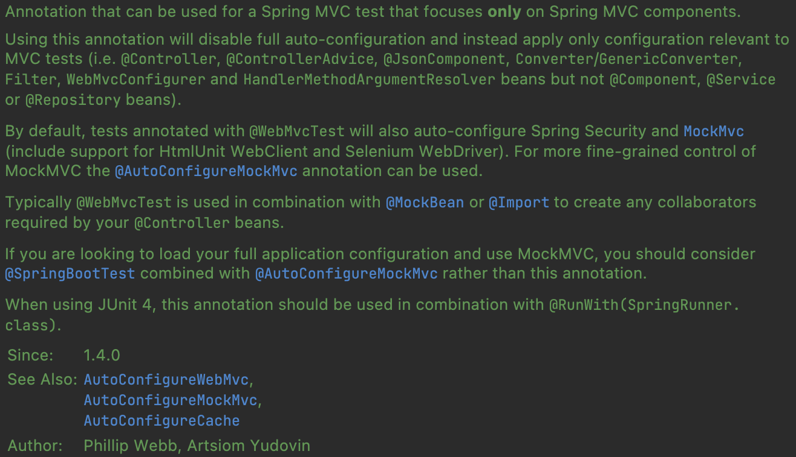
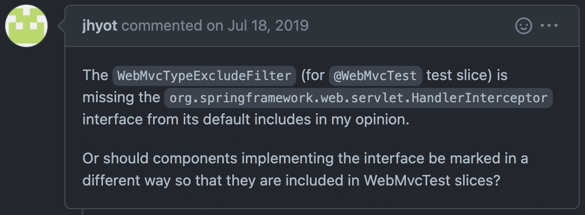
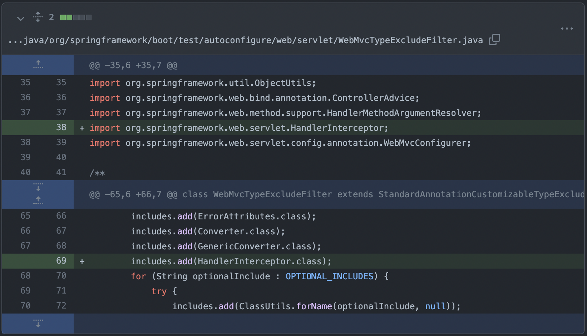

## 개요

---

안녕하세요 공책팀에서 백엔드 개발을 맡고 있는 쿼리치입니다.

1차 스프린트를 진행하면서 다양한 상황들을 마주했는데요.

이번 글을 통해 1차 스프린트 진행 중 마주치게 된 한 상황에 대해 기록해보고자 합니다.

 

## @WebMvcTest 사용 중..

---

Presentation Layer 를 테스트하기 위해 우린 흔히 `@WebMvcTest` 를 사용합니다.

`@SpringBootTest` 는 Application Context 를 완전히 실행하여 모든 빈을 등록하는 반면, `@WebMvcTest` 는 Presentation Layer 관련 빈만을 스캔 및 등록하기 때문에 보다 쾌적한 슬라이스 테스트를 진행할 수 있습니다.

이러한 이유 때문에 저희 공책팀 역시 `@WebMvcTest` 를 사용했습니다.

공식 문서를 찾아보면, 해당 어노테이션을 사용할 때 Auto-Configuration 을 비활성화하고 MVC 테스트에 필요한 컴포넌트만 등록해준다고 합니다. 이는 아래와 같습니다.

- `@Controller`
- `@ControllerAdvice`
- `@JsonComponent`
- `Converter/GenericConverter`
- `Filter`
- `WebMvcConfigurer`
- `HandlerMethodArgumentResolver`

반면 아래와 같은 컴포넌트는 등록되지 않는다고 하네요.

- `@Component`
- `@Service`
- `@Repository`

저희 공책팀에선 토큰을 활용한 인증 인가를 구현하기 위해 `WebMvcConfigurer` 를 통해 `HandlerMethodArgumentResolver` 와 `HandlerInterceptor` 를 적용했습니다.

이후 Presentation Layer 단의 인증 인가 테스트를 진행하며 한 가지 의문점이 들게 됩니다.

> 분명 `WebMvcConfigurer` 랑 `HandlerMethodArgumentResolver` 는 자동으로 등록해준다고 공식 문서에 명시되어 있는데, `HandlerInterceptor` 는 없네? 근데 따로 등록해주지 않아도 작동하네? 왜지?
> 

### 찾아보자

이유를 열심히 찾다보니 spring-boot GitHub 에서 [이런 이슈](https://github.com/spring-projects/spring-boot/issues/17572)를 발견하게 됩니다.

해당 이슈는 [이 PR](https://github.com/spring-projects/spring-boot/pull/17600) 을 통해 수정되게 되는데요. [어떤 코드들이 추가](https://github.com/spring-projects/spring-boot/commit/9f69b61d493c29ff5026bbbee306d507d60a0eac)되었는지 확인해봅시다.

위 커밋을 보면 `HandlerInterceptor` 가 추가된 것을 알 수 있습니다.

이로써 `@WebMvcTest` 수행 시 `HandlerInterceptor` 가 자동으로 빈 등록된다는 것을 알 수 있습니다.

### 그렇다면 왜 공식 문서에는 해당 내용이 반영되지 않은 것일까?

해당 공식문서는 spring-boot 1.4.0 버전에 작성된 글인 반면, 위 PR 은 2.2.0 단계에서 적용되었기 때문에 아직 공식 문서에 반영되지 않은 것으로 판단됩니다.

확실하게 알고 넘어가기 위해 [Spring Boot 2.2.0 Release Notes](https://github.com/spring-projects/spring-boot/wiki/Spring-Boot-2.2.0-Release-Notes) 를 찾아봅시다.

놀랍게도 위와 같은 문장이 적혀있는 것을 확인하실 수 있습니다.

 

## 결론

---

이번 사건을 통해 버전 확인에 대한 중요성을 알 수 있었고 공식 문서에 아직 반영되지 않은 기능들이 있을 수 있기 때문에 spring-boot GitHub 의 Release Note 를 잘 활용한다면 원하는 정보를 공식적으로 찾을 수 있다는 것을 알 수 있었습니다.