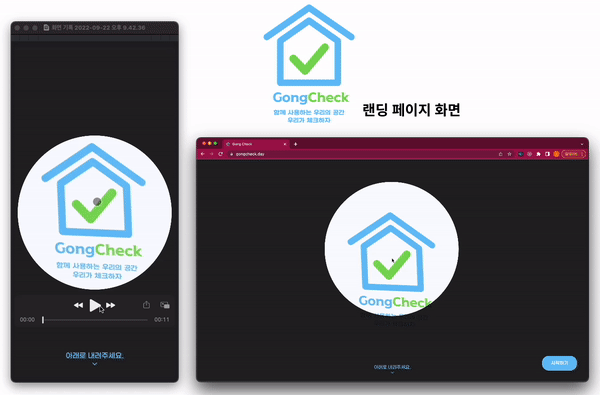
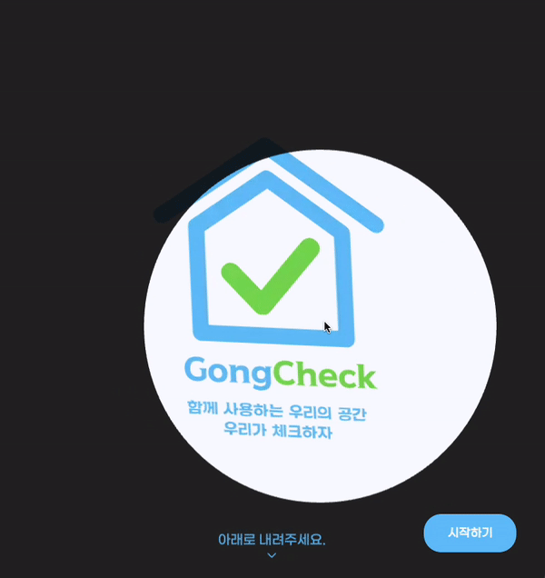

안녕하세요. "함께 사용하는 우리의 공간, 우리가 체크하자!"</br>
GongCheck 팀에서 프론트엔드 개발을 맡고 있는 코카콜라입니다.</br>
저희 팀은 우아한테크코스 4기 과정에서 공간관리 백 오피스를 개발하고 있습니다.

GongCheck 서비스를 운영하면서 처음 접하는 사용자에게 서비스에 대한 정보와 안내가 필요하다는 생각이 들었습니다. 그렇다면 어떤 방식으로 서비스에 대한 정보를 제공할까? 라는 생각을 하던 중 랜딩 페이지를 구현하게 되었는데요. 이번 포스팅에서는 인터랙티브 랜딩 페이지 개발 과정을 공유하고자 합니다.

### 목차
1. 랜딩 페이지
2. 서비스의 정체성을 첫 화면에 보여주자 - Canvas API
3. 스크롤 위치에 따라 애니메이션 효과 적용 - Intersection Observer API
4. 마치면서
5. 참고

---

# 1. 랜딩 페이지
위키백과에서는 랜딩 페이지(landing page)를 다음과 같이 설명하고 있습니다.
검색 엔진, 광고 등을 경유하여 접속하는 이용자가 최초로 보게 되는 웹페이지이다. 링크를 클릭하고 해당 웹페이지에 접속하면 마케터가 의도한 행위를 하도록 하는 페이지를 의미한다.

저희 팀이 구현할 랜딩 페이지는 GongCheck 서비스를 처음 접하는 사용자에게 우리의 서비스를 소개하기 위한 간략한 페이지라는 정의를 내렸고 구현 목록은 다음과 같습니다.
1. 첫 화면은 서비스의 정체성을 나타내는 GongCheck 로고
2. 공간을 사용하고 체크리스트를 작성하는 사용자에게 제공하는 서비스 사용법과 정보
3. 공간을 관리하고 생성하는 관리자 사용자에게 제공하는 서비스 정보
4. 인터랙티브 웹 사이트

구현된 랜딩 페이지는 아래 영상과 같습니다.
<div align="center">
    <style>
    .responsive-gif {
        max-width: 630px
    }
    @media (max-width: 400px) {
        .responsive-gif {
            max-width: 360px
        }
    }
    @media (max-width: 300px) {
        .responsive-gif {
            max-width: 300px
        }
    }
    .responsive-gif {
        padding: 10px;
    }
    </style>
    
    <p>(GongCheck 서비스는 다양한 사용자의 디바이스 환경에</br> 대응하기 위해 반응형이 적용되어 있습니다.)</p>
</div>
</br>

---

# 2. 서비스의 정체성을 첫 화면에 보여주자 - Canvas API
사용자가 웹 사이트에 처음 접속하게 되면 보여줄 Hero Section은 서비스의 정체성을 담은 GongCheck 로고를 보여주도록 했습니다.

## 2-1. 개발 초기
처음에는 화면 가운데에 로고만 덩그러니 배치되어 있었지만 심플한 느낌이 들어 로고에 애니메이션을 줘서 흐느적? 거리는 재미난 요소를 연출했습니다. 하지만 좀 더 로고에 집중시킬 수 있는 방법이 있지 않을까? 라는 생각이 들었습니다.

## 2-2. 화면에 몰입감 주기!
로고에 집중시켜 몰입감을 주기 위한 연출로 “조명을 비춘다?”라는 아이디어가 생각났습니다. 조명이 마우스에 따라 움직이면 더 생동감이 있고 스크롤을 내리면 조명이 커져 화면에 동적인 효과를 줄 수 있지 않을까? 라는 생각으로 구현하게 되었습니다.

정리하면 구현 요구사항은 다음과 같습니다.
- 로고를 비추는 조명 느낌의 연출
- 조명이 마우스를 따라 움직이기
- 스크롤을 내리면 조명이 커지기
- 스크롤 움직임에 영향을 받지 않고 화면 정중앙에 위치하는 로고 이미지

<div align="center">
    <style>
    .responsive-gif {
        max-width: 630px
    }
    @media (max-width: 400px) {
        .responsive-gif {
            max-width: 360px
        }
    }
    @media (max-width: 300px) {
        .responsive-gif {
            max-width: 300px
        }
    }
    .responsive-gif {
        padding: 10px;
    }
    </style>
    
</div>
</br>


## 2-3. 구현 - Canvas API
조명을 연출하기 위해 Canvas API를 활용했습니다. Canvas API는 2D 그래픽을 화면에 그리기 위해 사용되는 Web API입니다. HTML `<canvas>` 요소와 JavaScript로 2D 그래픽을 그릴 수 있는 도구들을 제공합니다.

화면에 그려질 조명 요소를 createCanvas로 구현합니다. 여기서 조명의 흰 부분과 조명 이외의 어두운 배경은 CanvasRenderingContext2D.clip() 메서드로 구현하면 됩니다. 마우스의 위치에 따라 조명을 움직이게 하기 위해 onMouseMove 핸들러 함수를 통해 마우스 위치를 createCanvas함수의 인자로 전달해주면 됩니다.

- [CanvasRenderingContext2D.clip()](https://developer.mozilla.org/en-US/docs/Web/API/CanvasRenderingContext2D/clip)

```javascript
// useHeroSection 코드 일부분
import useScroll from '@/hooks/useScroll';

const useHeroSection = () => {
	const canvasRef = useRef<HTMLCanvasElement>(null);
	
	const { scrollPosition } = useScroll();	
	const scrollPositionInt = scrollPosition + SCROLL_INTERVAL;

	const createCanvas = (
	    canvas: HTMLCanvasElement,
	    ctx: CanvasRenderingContext2D,
	    x: number,
	    y: number,
	    radius: number
	  ) => {
	    const scale = window.devicePixelRatio;
	    canvas.width = Math.floor(window.innerWidth * scale);
	    canvas.height = Math.floor(window.innerHeight * scale);
	    ctx.scale(scale, scale);
	
	    ctx.beginPath();
	    let circlePath = new Path2D();
	    circlePath.arc(x, y, radius, 0, Math.PI * 2);
	    circlePath.rect(0, 0, window.innerWidth, window.innerHeight);
	    ctx.clip(circlePath, 'evenodd'); // 조명 만들기
	    ctx.fillStyle = '#000000';
	    ctx.fillRect(0, 0, canvas.width, canvas.height);
	    ctx.closePath();
	  };

	const onMouseMove = (e: React.MouseEvent<HTMLElement, MouseEvent>) => {
		const canvas = canvasRef.current;
        const ctx = canvas.getContext('2d');

		const x = e.nativeEvent.offsetX;
        const y = e.nativeEvent.offsetY;
		const radius = CIRCLE_SIZE * scrollPositionInt;

		{...}

		createCanvas(canvas, ctx, x, y, radius);
	};

	return { onMouseMove, canvasRef };
}
```

마우스의 위치를 알기 위해서 section 요소의 onMouseMove 이벤트 속성을 사용하고 canvas 요소의 ref 속성에 canvasRef를 사용하여 구현합니다.
```javascript
// HeroSection 코드 일부분
const HeroSection: React.FC = () => {
  const { onMouseMove, canvasRef } = useHeroSection();

  return (
    <section onMouseMove={onMouseMove}>
      <div>
        <div css={/*img 스타일*/}>
            
        <div>
        <span>아래로 내려주세요.</span>
        <canvas css={/*cavas 스타일*/} ref={canvasRef}></canvas>
      </div>
    </section>
  );
};
```

- [Canvas_API](https://developer.mozilla.org/en-US/docs/Web/API/Canvas_API)
- [Hero Section 이란?](https://www.awebco.com/blog/hero-section/)

---

# 3. 스크롤 위치에 따라 애니메이션 효과 적용 - Intersection Observer API
랜딩 페이지를 보시면 스크롤 위치에 따라 애니메이션 효과가 적용된 것을 볼 수 있습니다. 초기 개발 단계에서는 단순히 스크롤 위치에 따라 각각의 Section에서 스크롤의 위치에 따라 애니메이션을 실행시켰습니다. 예를 들어 `HeroSection에서는 0~80` 스크롤 값을 사용하고 `UserViewSection1에서는 80~160`을 사용하는 식으로 하드코딩으로 구현이 되어 있었는데요.

왜 이렇게 하드코딩을 했냐고 질문을 하신다면…4차 데모 데이 전날에 랜딩 페이지를 기획하고 개발했습니다. **단 하루 만에 구현을 하다 보니**…하하하 레거시를 만들어 냈네요.

```javascript
import useScroll from '@/hooks/useScroll';

const Landing: React.FC = () => {

  return (
    <div>
      <HeroSection />
      <ViewSection1 />
      <ViewSection2 />
      <ViewSection3 />
      <ViewSection4 />
      <ViewSection5 />
    </div>
  );
};

const HeroSection: React.FC = () => {
	const { scrollPosition } = useScroll(); // 스크롤 위치 값
	// scrollPosition 값으로 애니메이션 제어
}

const ViewSection1: React.FC = () => {
	const { scrollPosition } = useScroll();
	// scrollPosition 값으로 애니메이션 제어
}
```

## 3-1. Refactoring 방향성
전체 페이지의 스크롤 위치 값으로 각각의 Section의 애니메이션을 동작시키다 보니 리팩토링 과정에서 다음과 같은 문제점을 발견했습니다.
- 각각의 Section 높이 값을 변경할 수 없다.
- Section의 순서를 변경할 수 없다.
- 각각의 Section의 높이, Section의 순서를 변경하게 되면 모든 Section의 스크롤 위치 값에 대한 애니메이션 구현 로직을 수정해야 한다.

페이지의 스크롤 위치 값에 의존적인 현재 상황을 개선하기 위해 각각의 Section이 독립적으로 스크롤 값을 가질 수 있게 리팩토링하기로 방향을 잡았고 요구사항을 정리하면 다음과 같습니다.
- 페이지의 스크롤을 움직일 때, 각각의 Section이 화면에 노출되는 시점과 화면에서 사라지는 시점을 알 수 있어야 한다.
- Section은 각자의 독립된 영역으로 분리되어야 한다.
    - 독립된 영역은 스크롤 움직임에 대해 자신이 노출된 비율을 퍼센티지로 환산할 수 있어야 한다.
    - 퍼센티지로 계산된 상태값으로 애니메이션을 동작시켜야 한다.

## 3-2. 화면에 노출되고 사라지는 시점 구하기
Intersection Observer API를 활용해 요소가 화면에 노출되고 사라지는 시점을 구했습니다. Intersection Observer API는 타겟 요소와 상위 혹은 최상위 요소와의 교차점을 관찰하여 교차되는지 아닌지를 구별하는 기능을 가지고 있습니다.

MDN에 따르면 다음과 같은 상황에 Intersection Observer API가 필요하다고 합니다.
- 페이지가 스크롤 되는 도중에 발생하는 이미지나 다른 컨텐츠의 지연 로딩.
- 스크롤 시에, 더 많은 컨텐츠가 로드 및 렌더링되어 사용자가 페이지를 이동하지 않아도 되게 하는 infinite-scroll 을 구현.
- 광고 수익을 계산하기 위한 용도로 광고의 가시성 보고.
- 사용자에게 결과가 표시되는 여부에 따라 작업이나 애니메이션을 수행할 지 여부를 결정.

Intersection Observer API를 활용해 타겟요소의 교차 시점을 isLoaded 값으로 판별할 수 있는 useIntersectionObserver hook을 구현했습니다.
```javascript
const useIntersectionObserver = <T extends Element>(targetRef: RefObject<T>, threshold: number = 0) => {
  const observerRef = useRef<IntersectionObserver>();
  const [isLoaded, setIsLoaded] = useState(false);

  const intersectionCallBack = (entries: IntersectionObserverEntry[], io: IntersectionObserver) => {
    entries.forEach(entry => {
      if (entry.isIntersecting) {
        setIsLoaded(true);
				// 타겟 요소가 화면에 보이는 지 체크
      }
    });
  };

  useEffect(() => {
    if (!observerRef.current) {
      observerRef.current = new IntersectionObserver(intersectionCallBack, {
        threshold, // 타겟 요소의 가시성 퍼센티지를 나타내는 속성
      });
    }

    targetRef.current && observerRef.current.observe(targetRef.current);

    return () => {
      observerRef.current.disconnect();
			// 해당 요소가 언마운트 시 disconnect
    };
  }, [targetRef.current]);

  return { isLoaded };
};
```

- [Intersection_Observer_API](https://developer.mozilla.org/ko/docs/Web/API/Intersection_Observer_API)

## 3-3. 독립된 영역으로 분리되어 스크롤 값 가지기
독립된 영역의 스크롤 값을 구하기 위해 useOnContainerScroll hook을 구현했습니다. useOnContainerScroll hook은 매개변수로 타겟 요소(container)와 스크롤 움직임에 따라 애니메이션을 실행시킬 onScroll을 받습니다. 아래의 코드를 좀 더 살펴보면 useIntersectionObserver hook으로 타켓 요소의 가시성을 판단하여 타겟 요소의 스크롤 값을 구할 onRunScroll 함수를 호출합니다.

onRunScroll 함수는 타켓 요소의 스크롤 값을 구하는 것뿐만 아니라 애니메이션을 동작시킬 함수로 화면의 렌더링에 영향을 미치기 때문에 requestAnimationFrame으로 비동기를 처리했습니다.

requestAnimationFrame 메서드는 브라우저 화면을 렌더링하는 리페인트 이전에 인자로 받은 콜백함수를 디스플레이 주사율에 맞춰 호출하기 때문에 애니메이션을 업데이트할 때 성능적으로 우수합니다.

```javascript
import useIntersectionObserver from './useIntersectionObserver';

const useOnContainerScroll = (container: RefObject<HTMLElement>, onScroll: () => void) => {
  const { isLoaded } = useIntersectionObserver<HTMLElement>(container);

  const dimension = {
    top: 0,
    width: 0,
    height: 0,
    scrollHeight: 0,
    windowHeight: 0,
  };
  const scrollInfo: ScrollInfo = { scrollY: 0, progress: 0 };
  const buffer = 1000;

  let isRunning = false;
  let latestRequestedTime = 0;

  const onRunScroll = () => {
    latestRequestedTime = Date.now();

    if (isRunning) {
      return;
    }

    isRunning = true;

    const play = () => {
      requestAnimationFrame(() => {
        const now = Date.now() - buffer;
        const scrolledY = window.pageYOffset + window.innerHeight;
        scrollInfo.scrollY = Math.max(scrolledY - dimension.top, 0);
        scrollInfo.progress = Math.min(scrollInfo.scrollY / dimension.scrollHeight, 1);

        onScroll();

        if (now < latestRequestedTime) {
          play();
        } else {
          isRunning = false;
        }
      });
    };

    play();
  };

  const setDimension = () => {
		// 현재 container의 수치로 dimension의 값을 할당 함
		dimension.width = container.current.clientWidth;
		{...}
  };

  useEffect(() => {
    if (isLoaded) {
      window.addEventListener('scroll', onRunScroll);
      window.addEventListener('resize', setDimension);
      setDimension();
    }
    return () => {
      window.removeEventListener('scroll', onRunScroll);
      window.removeEventListener('resize', setDimension);
    };
  }, [isLoaded]);

	return { dimension, scrollInfo };
};
```

이제 useOnContainerScroll hook으로 각각의 Section 영역의 스크롤 값을 progress로 구할 수 있습니다. progress 값으로 애니메이션을 작동시키면 됩니다.

```javascript
import useOnContainerScroll from '@/hooks/useOnContainerScroll';

const ViewSection1 = () => {
  const sectionRef = useRef<HTMLDivElement>(null);

  const { dimension, scrollInfo } = useOnContainerScroll(sectionRef, () => {
    const progress = Math.min(Math.max(0, scrollInfo.scrollY / dimension.windowHeight), 1) * 100;
		// progress 값으로 애니메이션으로 실행 시키면 됩니다.
		if(progress > 30){...}
		if(progress > 80){...}
		{...}
  });
};
```

---

# 4. 마치면서
4차 데모데이 전날 단 하루 만에 랜딩 페이지를 기획하고 개발했었는데 프론트엔드 개발자로서 재밌었던 경험이었습니다.(그 후에 수많은 리팩토링을 했던 건 비밀…)

항상 다른 사이트의 랜딩 페이지를 볼 때마다 우와.. 했었지만 우리가 직접 만들어 보니 쉽지 않은 작업이구나! 라는 생각이 들었네요 ㅎㅎ 프론트엔드 개발자 분들이 이글을 보고 계신다면 여러분의 랜딩 페이지를 한번 만들어 보시는 건 어떨까요? 매우 재미있는 추억이 되실거 같아요.

공책팀의 랜딩 페이지를 구경 하고싶으시다면 [공책 사이트](https://gongcheck.day/)에서 확인 하실 수 있습니다.

---

# 5. 참고

- [CanvasRenderingContext2D.clip()](https://developer.mozilla.org/en-US/docs/Web/API/CanvasRenderingContext2D/clip)
- [Canvas_API](https://developer.mozilla.org/en-US/docs/Web/API/Canvas_API)
- [Hero Section 이란?](https://www.awebco.com/blog/hero-section/)
- [Intersection_Observer_API](https://developer.mozilla.org/ko/docs/Web/API/Intersection_Observer_API)
