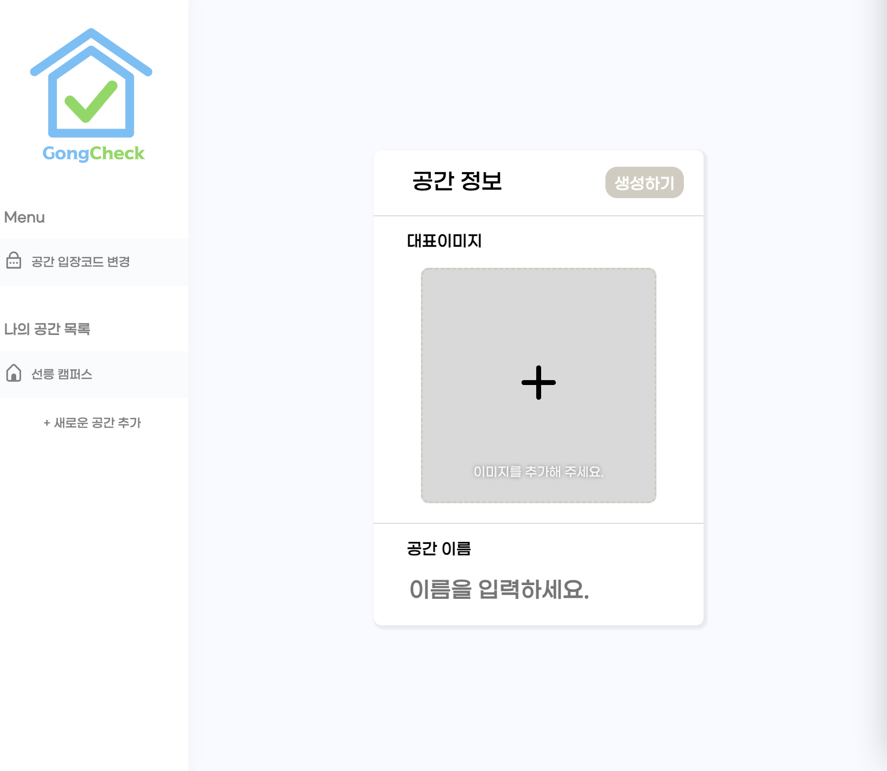
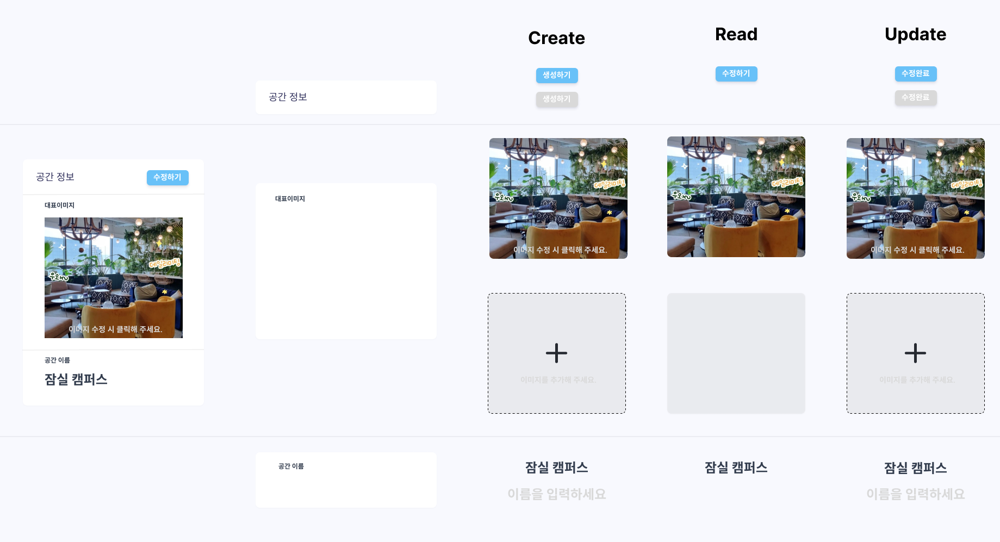
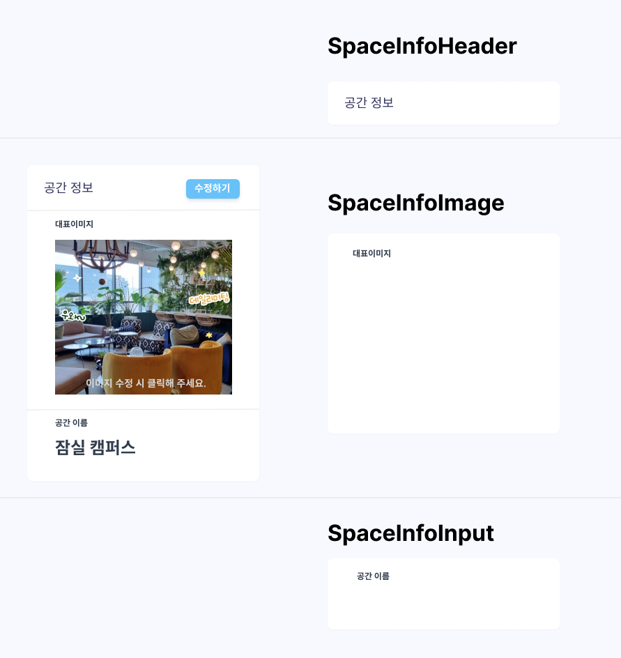

안녕하세요. "함께 사용하는 우리의 공간, 우리가 체크하자!"</br>
GongCheck 팀에서 프론트엔드 개발을 맡고 있는 코카콜라입니다.</br>
저희 팀은 우아한테크코스 4기 과정에서 공간관리 체크리스트 애플리케이션을 개발하고 있습니다.

프론트엔드 개발을 하다 보면 **"어떻게 하면 컴포넌트의 재사용성을 높일 수 있을까?"** 에 대해 많이 고민하게 될 텐데요. 저희 프론트엔드 팀에서는 다양한 페이지에서 사용되는 **공통의 도메인을 가지는 컴포넌트에** 대한 재사용성을 높이기 위해 **Compound Component Pattern**을 적용했습니다. 또한 이런 과정에서 **올바른 추상화**에 대해 다시 한번 생각하게 되었는데요. 이번 경험을 공유해 보고자 합니다!

---

# 1. 반복되는 컴포넌트를 마주한 순간
GongCheck 애플리케이션은 크게 두명의 사용자가 있습니다.
- 공간에 대한 체크리스트를 체크하는 `일반 사용자`
- 해당 공간을 생성하고 관리하는 `관리자`

아래 이미지들은 `관리자 페이지들`입니다.

<div align="center">
	
    <p>공간 정보 생성 페이지</p>
</div>
</br>
<div align="center">
	
    <p>공간 정보 보기 페이지</p>
</div>
</br>
<div align="center">
	
    <p>공간 정보 수정 페이지</p>
</div>
</br>

각 페이지에서 반복되는 컴포넌트가 있는데 혹시 눈치를 채셨나요?

<div align="center">
	
</div>
</br>
<div align="center">
    <style>
    .responsive-gif {
        max-width: 630px
    }
    @media (max-width: 400px) {
        .responsive-gif {
            max-width: 360px
        }
    }
    @media (max-width: 300px) {
        .responsive-gif {
            max-width: 300px
        }
    }
    .responsive-gif {
        padding: 10px;
    }
    </style>
    
    <p>다양한 기능을 가지는 공간 정보 컴포넌트</p>
</div>
</br>

한눈에 보이듯이 반복되는 컴포넌트는 공간 정보 컴포넌트입니다. 어떻게 구현해볼 수 있을까요?

---

# 2. 최초 구현
공간 정보 컴포넌트를 최초 구현할 때 많이 고민했습니다. 공간 정보 컴포넌트를 사용하는 페이지에 따라 Type으로 분류한다면 크게 Create, Read, Update로 구분할 수 있습니다.

공간 정보 컴포넌트는 각각의 페이지에서는 다음과 같은 기능과 요구사항을 가지고 있습니다.
- 공간 정보 생성 페이지
    - Create
    - 공간 이름 입력하기
    - 공간 이름이 입력되면 생성하기 버튼이 활성화 된다.
        - 생성하기 버튼을 클릭하면 공간이 생성되고 공간 정보 보기 페이지로 이동한다.
    - 이미지 추가 및 수정하기
        - 이미지 추가 유무에 따른 텍스트와 컴포넌트를 보여준다.
- 공간 정보 보기 페이지
    - Read
    - 공간 정보 보기
    - 수정하기 버튼을 클릭하면 공간 수정 페이지로 이동한다.
- 공간 정보 수정 페이지
    - Update
    - 기존의 공간 이름, 공간 이미지를 보여준다.
    - 공간 이름 수정하기
    - 공간 이름이 입력되면 수정완료 버튼이 활성화 된다.
        - 수정완료 버튼을 클릭하면 공간 정보가 수정되고 공간 정보 보기 페이지로 이동한다.
    - 이미지 추가 및 수정하기
        - 이미지 추가 유무에 따른 텍스트와 컴포넌트를 보여준다.

공간 정보 컴포넌트의 하위 컴포넌트들을 Type에 따라 시각적으로 분리하면 다음과 같습니다.

<div align="center">
	
</div>
</br>

간단해 보일 수도 있지만 실제 코드를 작성하다 보니 Type에 따른 이벤트 처리 및 상태 값에 따른 분기 처리가 복잡해졌습니다. 간략히 코드를 보면 다음과 같습니다.(부끄럽네요...)


```javascript
// SpaceInfo 컴포넌트
interface SpaceInfoProps {
  type: 'read' | 'create' | 'update';
  inputText?: '' | string;
  data?: { name: string; imageUrl: string; id: number } | undefined;
}

const SpaceInfo: React.FC<SpaceInfoProps> = ({ type = 'read', inputText = '', data }) => {
  const { onChangeSpaceName, onClickEditSpaceInfo, ... } = useSpaceInfo(data, type);

  return (
    <div css={/*SpaceInfo 스타일*/}>
        {...}
        <p>공간 정보</p>
        {type === 'read' ? (
            <Button type="button" onClick={onClickEditSpaceInfo}>수정하기</Button>
        ) : (
            <Button type="submit">{type === 'create' ? '생성하기' : '수정완료'}</Button>
        )}
        {...}
        <p>공간 이름</p>
        {type === 'read' ? (
            <input name="nameInput" type="text" defaultValue={data?.name} readOnly />
        ) : (
            <input
                name="nameInput"
                placeholder="이름을 입력하세요"
                type="text"
                defaultValue={data?.name || inputText || ''}
                onChange={onChangeSpaceName}
                required
            />
        )}
        {...}
    </div>
  );
};
```

공간 정보 컴포넌트를 사용하는 페이지의 코드는 다음과 같습니다.

```javascript
// 공간 정보 생성 페이지
const SpaceCreate: React.FC = () => {
  const { onSubmitCreateSpace } = useSpaceForm();

  return (
    <div css={/*SpaceCreate 스타일*/}>
        <form onSubmit={onSubmitCreateSpace} encType="multipart/form-data">
            <SpaceInfo type={'create'} />
        </form>
    </div>
  );
};

// 공간 정보 보기 페이지
const DashBoard: React.FC = () => {
  const {
    spaceData,
    ...
  } = useDashBoard();

  return (
    <div css={/*DashBoard 스타일*/}>
        {...}
        <SpaceInfo type={'read'} data={spaceData} />
    </div>
  );
};
```

위처럼 코드를 구현하다 보니 가독성이 떨어지고 유지보수하기 어려워졌습니다. 또한 공간 정보 생성, 수정 페이지에서는 button의 type이 'submit'인 반면에 보기 페이지에서는 'button'이기 때문에 공간 정보 컴포넌트를 사용하는 곳에서 form 태그로 감싸줘야 하는 경우가 발생했습니다.

또한 코드를 작성하고 코드리뷰를 하는 과정에서 다음과 같은 의견이 나왔습니다.
- 코드를 이해하기 어렵다.
- 공간 정보 컴포넌트를 사용하는 곳에서 어떻게 사용해야 할지 모르겠다.
- 로직이 어떻게 되는지 알수가 없어 코드 분석을 하는 비용이 많이 든다.

## 2-1. 왜? 이렇게 구현했나요?
SpaceInfo 컴포넌트가 상황에 따라 각기 다른 요소들을 제어해야 하므로 이런 문제가 나왔다는 생각이 드는데요. 그럼 CreateSpaceInfo, ReadSpaceInfo, UpdateSpaceInfo로 컴포넌트를 분리해서 사용하면 안 되나? 라는 생각이 들 수도 있습니다.

하지만, 3가지 컴포넌트로 분리하자니 중복되는 코드들이 많이 생기는 문제점이 있었습니다. 또한 컴포넌트를 분리하면 독립된 환경이 되어 응집성이 떨어지므로 나중에는 완전히 다른 컴포넌트가 되어 **컴포넌트 파편화가 발생하는 문제가 생깁니다.** (예를 들면 폰트, 컬러, width 등 디자인 요소가 제각각 변경될 상황이 있습니다.)

결과적으로는 완전히 추상화가 잘못되었다는 것을 알 수 있었는데요. 이때 `"올바른 추상화가 무엇일까?"` 에 대해 다시 한번 생각하게 되었고 다음과 같이 생각을 정리했습니다.

> 올바른 추상화란? 다른 개발자가 컴포넌트를 사용처에서 선언적으로 사용할 수 있어야 한다. 컴포넌트가 어떤 로직을 수행하는지에 대해 명시적으로 알 수 있어야 한다.

---

# 3. 합성 컴포넌트 도입
합성 컴포넌트 패턴은 하나의 컴포넌트를 여러 가지 집합체로 분리한 뒤, 분리된 각 컴포넌트를 사용하는 쪽에서 조합해 사용하는 컴포넌트 패턴을 의미합니다.

```javascript
<select name="pets" id="pet-select">
    <option value="">--Please choose an option--</option>
    <option value="dog">Dog</option>
    <option value="cat">Cat</option>
</select>
```

합성 컴포넌트 패턴의 예시로 위의 코드를 보시면 `<select>`와 `<option>` 태그의 조합으로 이루어져 사용되는 것을 볼 수 있습니다. `<select>`와 `<option>`은 각각 독립적인 요소이고 큰 의미를 가지지는 않지만 사용하는 곳에서 요소들을 자유롭게 조합함으로써 화면에 의미 있는 요소로 표현됩니다.([참고: select MDN](https://developer.mozilla.org/ko/docs/Web/HTML/Element/select))

이처럼 사용하는 곳에서 컴포넌트의 조합을 활용할 수 있다면 높은 재사용성을 만족하면서 다양한 상황에 사용할 수 있다는 생각이 들어 도입해 보게 되었습니다. 앞에서 설명했던 최초 구현 시 구현했던 컴포넌트를 합성 컴포넌트로 어떻게 적용했는지 간략하게 설명해 보겠습니다.

## 3-1. 서브 컴포넌트 구현
`<option>` 태그에 해당하는 서브 컴포넌트를 구현합니다. 우선 SpaceInfo 컴포넌트가 가질 수 있는 하위 컴포넌트를 아래의 이미지처럼 SpaceInfoHeader, SpaceInfoImage, SpaceInfoInput으로 서브 컴포넌트를 분리했습니다.

<div align="center"></div>
</br>


위의 이미지처럼 서브 컴포넌트로 분리했고 추가로 공간 이름을 보여주는 SpaceNameText 컴포넌트를 서브로 분리했습니다. SpaceInfo 컴포넌트의 구성요소가 될 수 있는 부분들을 서브 컴포넌트로 분류했고 사용하는 곳에서 서브 컴포넌트의 조합과 children으로 유연하게 SpaceInfo 컴포넌트를 구현할 수 있게 했습니다.

```javascript
interface SpaceInfoHeaderProps {
  children: React.ReactNode;
}

interface SpaceNameTextProps {
  children: React.ReactNode;
}

const SpaceInfoHeader: React.FC<SpaceInfoHeaderProps> = ({ children }) => {
  return <div css={/*SpaceInfoHeader 스타일*/}>{children}</div>;
};

const SpaceNameText: React.FC<SpaceNameTextProps> = ({ children }) => {
  return <p css={/*SpaceNameText 스타일*/}>{children}</p>;
};

// ... SpaceInfo 서브 컴포넌트
```

## 3-2. 메인 컴포넌트 구현
`<select>` 태그에 해당하는 메인 컴포넌트를 구현합니다. SpaceInfo의 서브 컴포넌트들을 유연하게 묶어서 화면에 보여주는 Wrapper의 성격을 가지고 있습니다.

```javascript
interface SpaceInfoMainProps {
  children: React.ReactNode;
}

const SpaceInfoMain: React.FC<SpaceInfoMainProps> = ({ children }) => {
  return <div css={/*SpaceInfoMain 스타일*/}>{children}</div>;
};
```

## 3-3. 메인 & 서브 컴포넌트를 묶어서 export
구현한 메인, 서브 컴포넌트를 묶어서 export 합니다. 사용하는 곳에서는 다음과 같이 간단하게 사용할 수 있습니다. 이렇게 구현하면 같은 도메인끼리 컴포넌트가 응집되어 사용됨으로써 가독성에 도움이 됩니다.

```javascript
export const SpaceInfo = Object.assign(SpaceInfoMain, {
  header: SpaceInfoHeader,
  ImageBox: SpaceInfoImage,
  InputBox: SpaceInfoInput,
  nameText: SpaceNameText,
  ...
});

// Usage
<SpaceInfo>
    <SpaceInfo.header>
        <button>생성하기</button>
    </SpaceInfo.header>
    {...}
</SpaceInfo>
```


## 3-4. 완성된 합성 컴포넌트를 사용해 화면 구현
다양한 사용처에서 합성 컴포넌트로 유연하게 화면을 구현할 수 있습니다. 이렇게 구현함으로써 코드를 직관적으로 확인이 가능해 가독성이 좋아졌고 유연하게 서브 컴포넌트를 추가할 수 있어 다양한 요구사항에 쉽게 반영할 수 있습니다.

또한 합성 컴포넌트를 활용해 SpaceInfoCreateBox, SpaceInfoDisplayBox, SpaceInfoUpdateBox로 컴포넌트를 추상화 시켜 명시적인 컴포넌트를 구현했습니다. 최초 구현 시에는 이렇게 컴포넌트를 분리하면 **컴포넌트 파편화**가 발생한다고 했는데 합성 컴포넌트로 사용되는 컴포넌트를 **한 곳에서 제어하고 응집시킴으로써** 고려했던 문제를 해결했습니다.

```javascript
// 공간 정보 생성 컴포넌트
const SpaceInfoCreateBox: React.FC = () => {
  const { isActiveSubmit, onSubmitCreateSpace, onChangeSpaceName } = useSpaceCreateForm();
  const { imageUrl, onChangeImage } = useImage();

  return (
    <form onSubmit={e => onSubmitCreateSpace(e, imageUrl)} encType="multipart/form-data">
      <SpaceInfo>
        <SpaceInfo.header>
          <Button type="submit" css={styles.button({ isActive: isActiveSubmit })}>
            생성하기
          </Button>
        </SpaceInfo.header>
        <SpaceInfo.ImageBox>
          <ImageBox>
            <ImageBox.changeBox imageUrl={imageUrl} onChangeImage={onChangeImage} />
          </ImageBox>
        </SpaceInfo.ImageBox>
        {/* 유연하게 여기저기에 서브 컴포넌트 or Element를 추가해서 
        SpaceInfo컴포넌트를 수정 하지 않고 구현할 수 있습니다. */}
        <SpaceInfo.InputBox>
          <input
            css={styles.input}
            name="nameInput"
            placeholder="이름을 입력하세요."
            type="text"
            maxLength={10}
            onChange={onChangeSpaceName}
            required
          />
        </SpaceInfo.InputBox>
      </SpaceInfo>
    </form>
  );
};

// 공간 정보 생성 페이지
const SpaceCreate: React.FC = () => {
  return (
    <div css={/*SpaceCreate 스타일*/}>
      {/* 공간 정보 생성 컴포넌트 */}
      <SpaceInfoCreateBox />
    </div>
  );
};
```


---

# 4. 마치면서
요구사항이 복잡하고 다양한 상황을 고려해야 했던 컴포넌트를 재사용하기 위해 많이 고민했는데 합성 컴포넌트를 도입하면서 고민했던 문제를 해결할 수 있어 좋았습니다.

하지만 합성 컴포넌트가 만능이라고는 말할 수 없습니다. 단순히 render prop 패턴으로 props를 공유해서 구현하는 방식이 좀 더 직관적으로 코드를 구현할 수 있습니다. 개발할 때 요구사항에 따라 적절하게 합성 컴포넌트를 도입해보면 좋을 것 같습니다.

---

> 고민 끝에 구현된 결과물은 [공책 사이트](https://gongcheck.day/)에서 경험 하실 수 있습니다.


---

# 5. 참고

https://fe-developers.kakaoent.com/2022/220731-composition-component/
https://jbee.io/web/components-should-be-flexible/
https://wishket.tistory.com/12
https://kentcdodds.com/blog/compound-components-with-react-hooks
