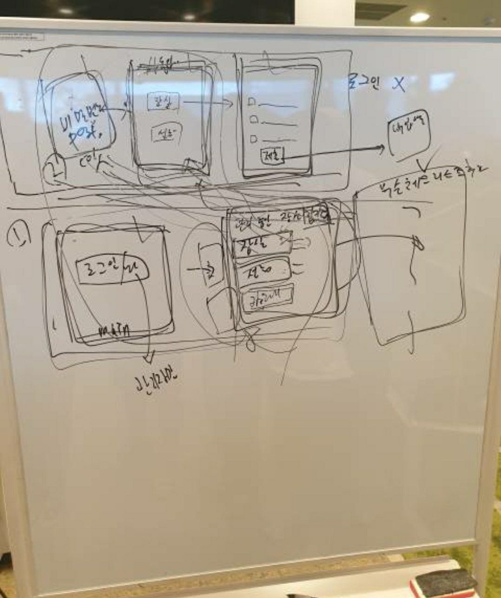
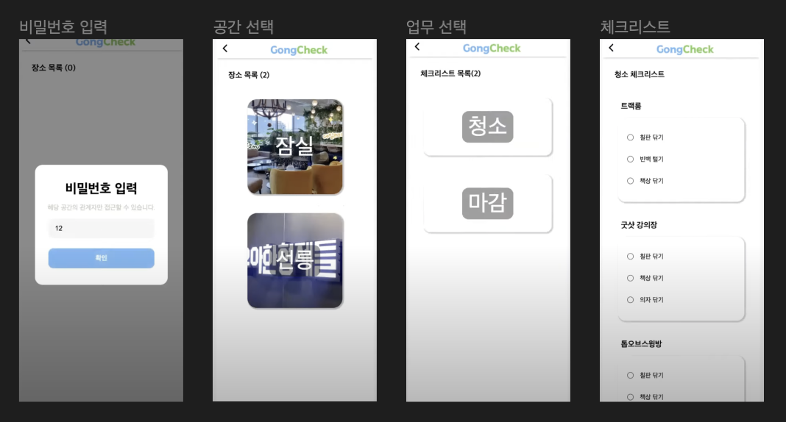
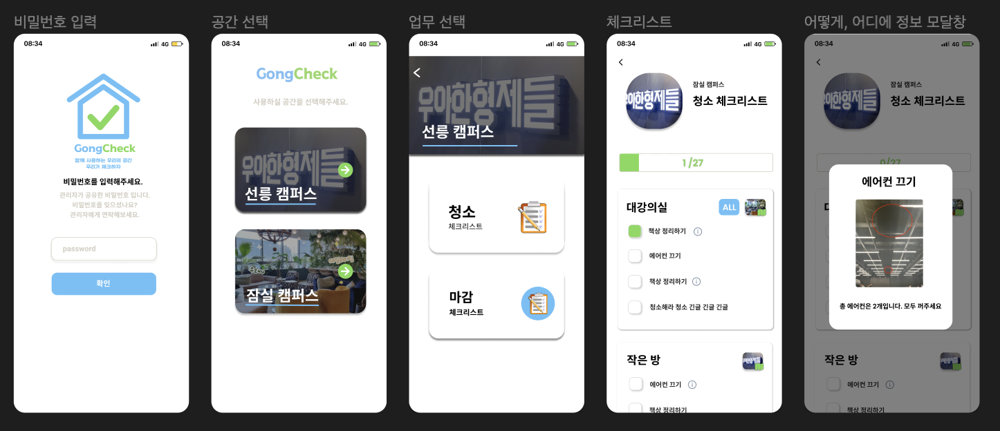
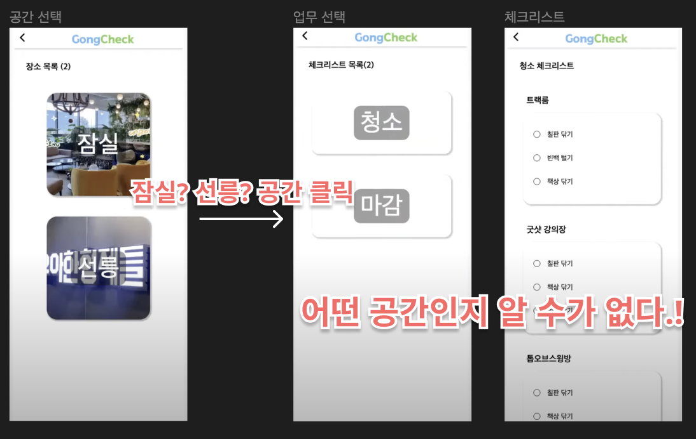
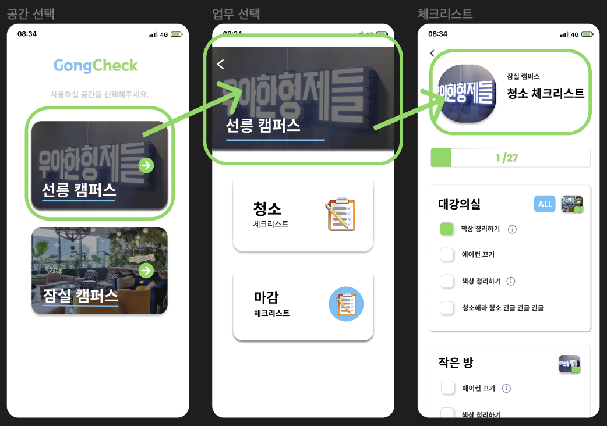
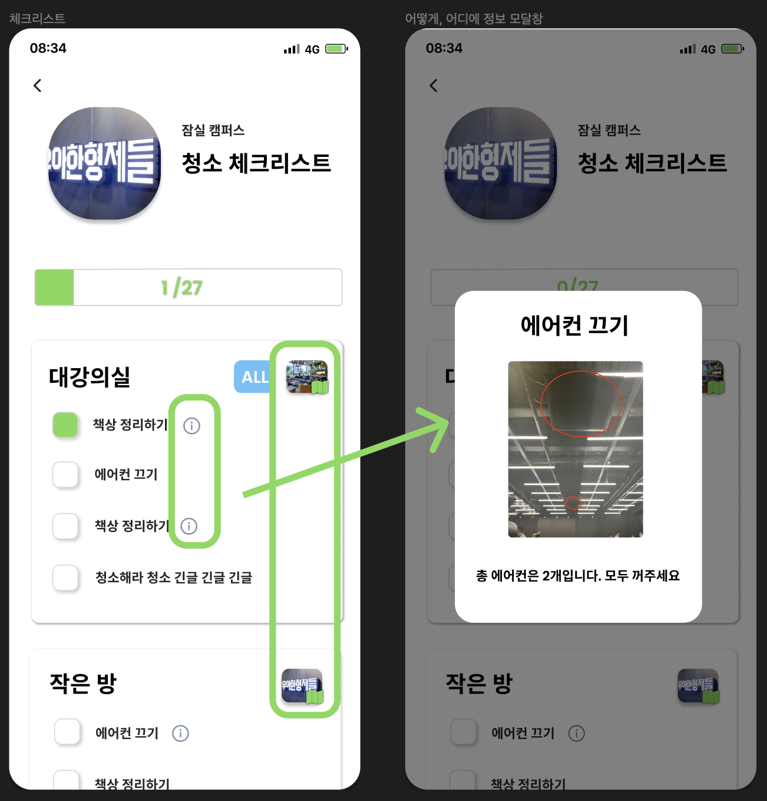
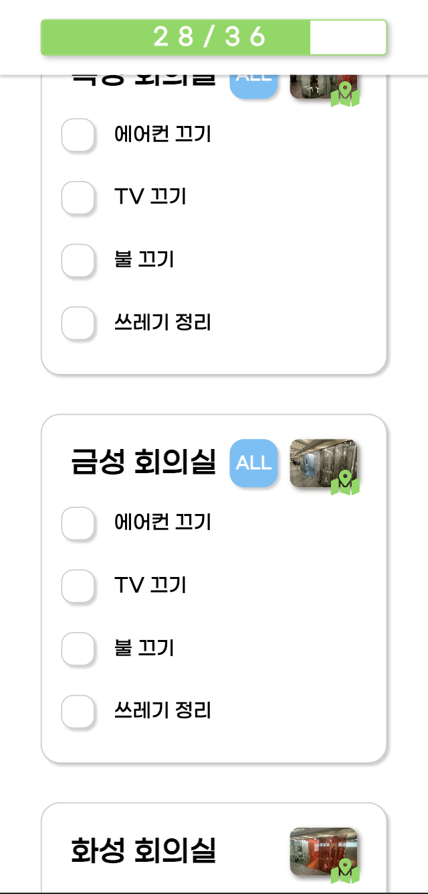

안녕하세요. "함께 사용하는 우리의 공간, 우리가 체크하자!" 
GongCheck 팀에서 프론트엔드 개발을 맡고 있는 코카콜라입니다. 
저희 팀은 우아한테크코스 4기 과정에서 공간관리 백 오피스를 개발하고 있습니다.

이번 포스팅은 스프린트 2주 차에 공책 팀이 고민했던 UI/UX(디자인 부분)에 대한 내용을 담고 있습니다.
(공책 팀의 스프린트 기간은 2주입니다.)

### 목차
1. 개발 초기 UI
2. 사용자의 피드백
3. 빠르게! 사용자 경험을 향상시킬 수 있었던 이유는?
4. 마치면서

---

# 1. 개발 초기 UI

GongCheck 애플리케이션은 크게 두명의 사용자가 있습니다.

- 공간에 대한 체크리스트를 체크하는 `일반 사용자`
- 해당 공간을 생성하고 관리하는 `관리자`

스프린트 1주 차에는 공간을 사용하고 체크리스트를 작성하는 일반 사용자 쪽 화면을 구현하는 게 목표였습니다. 일반 사용자 쪽 화면의 흐름을 간단하게 말씀드리면 아래와 같이 구성됩니다.

비밀번호 입력 → 공간 선택 → 업무 선택 → 체크리스트 

    
    
화면 흐름을 정하기 위한 흔적들...

 

화면의 흐름을 정했지만 어떻게 화면을 설계해야 할지는 막막했습니다. 그리고 디자이너가 없기 때문에 디자인을 직접 해야 했습니다.(막막함 x2)

다음과 같이 너무 못생기게 UI를 디자인했지만 우선 사용자에게 서비스를 제공하고 피드백을 통해 디자인을 수정하고 더 나은 UX을 생각하기로 결정했습니다.

    
    
스프린트 1주 차 결과물, UI 디자인 저작툴 Figma로 화면을 디자인했습니다.

 

[스프린트 1주 차 데모 영상을 통해 자세히 알 수 있습니다.](https://www.youtube.com/watch?v=fUG-_s4z6Ww&t=448s)

---

# 2. 사용자의 피드백

크게 다음과 같은 사용자의 피드백을 수렴했습니다.
- 현재 있는 페이지가 어디인지 모르겠다.
- 체크리스트에서 체크 항목이 무엇을 하는지 모르겠다.
- 체크리스트에서 체크 항목이 어디에 있는지 모르겠다.
- 체크 항목이 몇 개 남았는지 모르겠다.

스프린트 2주 차에 사용자의 피드백을 기반으로 화면을 수정 했습니다.
바뀐 디자인을 보면 다음과 같습니다.

    

 

사용자의 피드백을 기반으로 어떻게 변경되었는지 알아보겠습니다.

## 2-1. 현재 있는 페이지가 어디인지 모르겠다.

스프린트 1주 차에는 공간(장소)을 선택하고 다음 페이지로 이동을 해도 내가 어떤 공간의 체크리스트를 하고 있는지 알 수가 없었습니다.

    
    
스프린트 1주 차 문제점

 

스프린트 2주 차에는 선택한 공간을 화면에 계속 노출하는 방식으로 사용자 경험을 향상시켰습니다.

    
    
스프린트 2주 차 개선된 화면

 

## 2-2. 체크리스트에서 체크 항목이 무엇을? 어떻게? 하는지 모르겠다.

체크리스트에서 체크 항목이 ‘대강의실’의 ‘에어컨 끄기’라면 대강의실은 어디인지? 에어컨은 어떻게? 끄는 것인지 알 수가 없습니다. 해당 체크 항목을 올바르게 수행하게 도와줄 안내 표지판 같은 컴포넌트가 필요했습니다.

안내 표지판을 어떤 형태로 노출할지 팀원들과 회의를 통해 다음과 같은 고려사항을 결정했습니다.

- 체크 항목에 대한 디테일한 설명이 있다면 아이콘이나 이미지로 노출한다.
- 디테일한 설명은 모달 창의 형태로 보여 준다.
- 설명의 형태는 단순한 텍스트뿐만 아니라 이미지, 영상으로도 보여줘야 한다.

다음과 같이 고려사항을 반영했습니다.

    
    
무엇을? 어떻게? 개선된 화면

 

## 2-3. 체크 항목이 몇개 남았는지 모르겠다.

화면의 상단에 ProgressBar로 체크 현황을 노출했습니다.

    
    
ProgressBar

 

---

# 3. 빠르게! 사용자 경험을 향상시킬 수 있었던 이유는?

하나의 프로덕트를 구현하고 서비스를 운영해보는 게 처음이었던 저희는 사용자들에게 어떻게 더 나은 UX를 제공해야 할지 막막했습니다. 많은 회의와 다양한 디자인 시안을 만들어 봤지만, 팀 내에서 합의점을 찾질 못했습니다.

그래서 일단 프로덕트를 구현해 초기 유저의 반응을 살펴보자! 라는 생각으로 스프린트 1주 차에 프로덕트의 일부분을 구현해 서비스를 운영하여 초기 유저분들의 피드백을 받을 수 있었습니다.

해당 피드백을 바탕으로 스프린트 2주 차에 리팩토링했는데 디자인이 모두 변경된 점을 확인할 수 있습니다. 이 과정에서 큰 비용이 들 거라 예상했지만 코드를 작성할 때 비즈니스 로직을 따로 분리를 해놨기 때문에 새로운 디자인의 컴포넌트를 구현하는 데 어려움이 없었습니다.

빠르게! 사용자 경험을 향상시킬 수 있었던 이유는 다음과 같습니다.
- 프로덕트의 일부분이라도 빠르게 구현하여 서비스를 운영해본다.
- 유저의 피드백을 기반으로 서비스를 개선해 본다.
- 비즈니스 로직을 분리하여 디자인 요소를 유연하게 구현할 수 있게 한다.

---

# 4. 마치면서

이번 포스팅에서는 공책(GongCheck)을 이용하는 사용자들에게 최고의 경험을 선사하기 위한 과정을 기록했습니다. 디자인으로 어떻게 UX를 향상할 수 있는지에 대해 고민했는데요. 다음 포스팅에서는 성능개선을 통한 UX를 향상하는 과정을 소개하겠습니다.

공책 팀의 개발 과정은 아래의 영상들로 확인할 수 있습니다.

[프로젝트 2차 데모 영상](https://www.youtube.com/watch?v=ZbXjua2uDC8)

[프로젝트 3차 데모 영상](https://www.youtube.com/watch?v=rBufGKaRtZc&t=560s)
