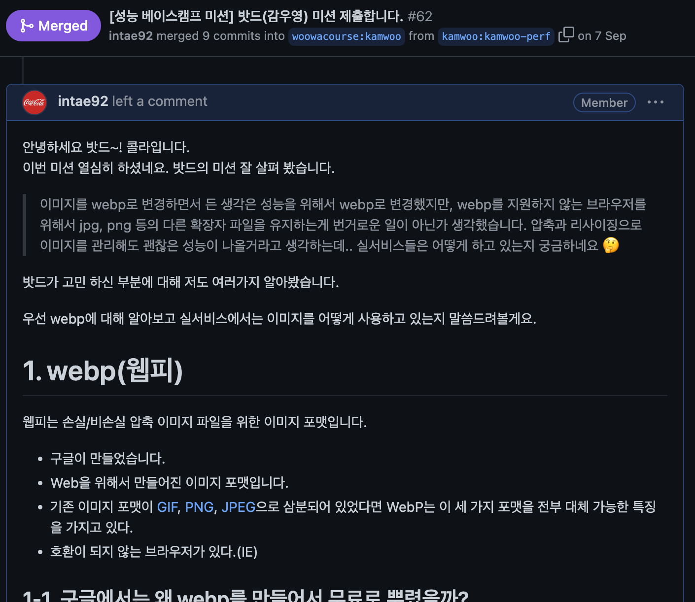

안녕하세요. "함께 사용하는 우리의 공간, 우리가 체크하자!"</br>
GongCheck 팀에서 프론트엔드 개발을 맡고 있는 코카콜라입니다.</br>
저희 팀은 우아한테크코스 4기 과정에서 공간관리 백 오피스를 개발하고 있습니다.

공책 팀은 사용자 경험을 개선하기 위해 다양한 시도를 하고 있는데요. 이번에는 성능 개선을 통한 사용자 경험을 향상했던 경험을 공유하겠습니다.

---

# 1. 최적화된 리소스 사용

적은 용량의 리소스를 사용하면 빠르게 전달 할 수 있어 화면에 빠르게 보여줄 수 있는데요. 공책 애플리케이션에서는 여러 페이지에서 이미지를 사용하여 화면을 구성하고 있고 사용자의 다양한 디바이스 규격에 알맞은 화면 비율을 제공하는 반응형을 적용한 상태입니다. 하지만 최적화된 이미지를 사용하지 않고 있어서 로딩되는 속도가 느리고 화면 비율에 맞지 않는 이미지를 사용하는 문제점을 가지고 있었습니다.

정리하면 이미지 리소스 최적화를 통해 다음과 같은 문제를 해결하고자 했습니다.
- 적은 용량의 이미지 리소스로 화면에 보여지는 로딩 시간 줄이기
- 데스크탑, 태블릿, 모바일 환경의 규격에 맞는 이미지 크기 사용하기

## 1-1. 적은 용량의 Webp 이미지 포맷 사용

이미지 리소스를 최적화 시키기 위해 Webp 포맷을 선택했습니다. Webp의 특징으로는 다음과 같습니다.
- Webp 확장자는 인터넷에서 이미지가 로딩되는 시간을 단축하기 위해 Google이 출시한 파일 포맷이다.
- Webp를 사용하면 웹 사이트에서 고품질 이미지를 표현할 수 있고 PNG, JPEG등 기존 포맷보다 파일 크기가 작아진다.

하지만 Webp 포맷이 호환이 안 되는 브라우저가 있어 PNG 포맷과 함께 사용했고 브라우저 지원하는 이미지 포맷을 선택하여 사용하기 위해 `<picture>`태그를 다음과 같이 활용했습니다.

```javascript
<picture>
  <source type="image/webp" srcSet={image.url} />
  
</picture>
```

[picture mdn](https://developer.mozilla.org/en-US/docs/Web/HTML/Element/picture)

## 1-2. 데스크탑, 태블릿, 모바일 환경의 규격에 맞는 이미지 크기 사용하기
반응형에 따른 이미지 사이즈 최적화를 왜 해야 할까요? [optimize LCP]([https://web.dev/i18n/ko/optimize-lcp/](https://web.dev/i18n/ko/optimize-lcp/))에 따르면 사용자 경험에 큰 영향을 미치는 요소 중 하나가 화면에 렌더링 되는 콘텐츠를 보기까지 얼마나 많은 시간이 소요되는 점입니다.

반응형에 따라 이미지 사이즈를 최적화한다면 콘텐츠 요소가 기존보다 빠르게 렌더링 되어 더 나은 사용자 경험을 줄 수 있습니다.

> LCP(Largest Contentful Paint)는 화면에서 가장 큰 콘텐츠 요소가 렌더링을 완료한 시점을 말합니다.

아래와 같이 반응형에 따른 이미지 최적화를 했습니다.

```javascript
<picture>
  <source media={`(max-width: ${screenSize.DESKTOP}px)`} type="image/webp" srcSet={image['320w']} />
  <source media={`(max-width: ${screenSize.TABLET}px)`} type="image/webp" srcSet={image['240w']} />
  <source media={`(max-width: ${screenSize.MOBILE}px)`} type="image/webp" srcSet={image['160w']} />
  <source type="image/webp" srcSet={image['480w']} />
  
</picture>
```

## 1-3. 이미지 서버

프론트에서는 리소스는 서버로부터 전달받아야 하는데요. 저희 공책팀의 백엔드에서는 이미지 서버를 구축하여 최적화를 진행했습니다.
백엔드 오리의 이미지 서버 글을 보시면 자세한 내용을 확인 하실 수 있습니다.

[백엔드 오리 - 이미지 서버]([https://tecoble.techcourse.co.kr/post/2022-09-13-image-storage-server/](https://tecoble.techcourse.co.kr/post/2022-09-13-image-storage-server/))

## 1-4. 다른 서비스에서는 이미지를 어떻게 보여주고 있을까?

공책팀에서는 사용자의 경험을 향상시키기 위해 Webp 포맷, 반응형에 따른 이미지 리사이징을 적용했는데요. 그렇다면 현재 서비스 중인 다른 서비스들은 어떤 방식으로 이미지를 보여주고 있을까요? 이 물음에 대한 궁금증이 생겨 다양한 서비스들을 확인해 봤습니다.

<div align="center">
    
    <p>성능개선 우테코 미션에서의 코드리뷰 내용 일부분...</p>
</div>
</br>

자세한 내용은 우아한테크코스 성능개선 미션의 밧드 PR에 대한 코멘트를 통해 확인하실 수 있습니다.

[성능개선 코드리뷰 코멘트](https://github.com/woowacourse/perf-basecamp/pull/62)

---

# 2. Lazy Loading

Lazy Loading을 적용하여 현재 보이는 콘텐츠만 빠르게 로딩하고 그 이외의 콘텐츠는 나중에 로딩하여 페이지를 보여주는 시간을 단축했습니다.

## 2-1. IntersectionObserver API

Lazy Loading은 IntersectionObserver API를 활용하여 현재 관찰 대상인 이미지 요소가 뷰포트에 교차되는 순간을 캐치하여 로딩되도록 구현했습니다. 공책 서비스에서는 다양한 곳에서 IntersectionObserver API를 활용하고 있는데요. 그중 체크리스트 페이지의 이미지를 제어하는 LazyImage hook은 아래와 같습니다.

```javascript
const LazyImage: React.FC<LazyImageProps> = ({ imageUrl, ...props }) => {
  const lazyImageRef = useRef<HTMLImageElement>(null);
  const observerRef = useRef<IntersectionObserver>();
  const [isLoaded, setIsLoaded] = useState(false);

  const intersectionCallBack = (entries: IntersectionObserverEntry[], io: IntersectionObserver) => {
    entries.forEach(entry => {
      if (entry.isIntersecting) {
        io.unobserve(entry.target);
        setIsLoaded(true);
      }
    });
  };

  useEffect(() => {
    if (!observerRef.current) {
      observerRef.current = new IntersectionObserver(intersectionCallBack);
    }

    lazyImageRef.current && observerRef.current.observe(lazyImageRef.current);

    return () => observerRef.current && observerRef.current.disconnect();
  }, []);

  return ;
};
```

데모 4차 영상을 통해 Lazy Loading에 대한 이미지 최적화를 확인 하실 수 있습니다.

[프로젝트 데모 4차 영상](https://www.youtube.com/watch?v=ssseI1nySmI&t=180s)

---

# 3. 마치면서

이번 포스팅에서는 공책(GongCheck)을 이용하는 사용자들에게 최고의 경험을 선사하기 위한 요소 중 하나인 이미지 리소스 처리에 대해 기록했습니다.

---

# 4. 참고

- [picture mdn]([https://developer.mozilla.org/en-US/docs/Web/HTML/Element/picture](https://developer.mozilla.org/en-US/docs/Web/HTML/Element/picture))
- [optimize LCP]([https://web.dev/i18n/ko/optimize-lcp/](https://web.dev/i18n/ko/optimize-lcp/))
- [Lazy Loading]([https://developer.mozilla.org/en-US/docs/Web/Performance/Lazy_loading](https://developer.mozilla.org/en-US/docs/Web/Performance/Lazy_loading))
- [IntersectionObserver]([https://developer.mozilla.org/ko/docs/Web/API/IntersectionObserver](https://developer.mozilla.org/ko/docs/Web/API/IntersectionObserver))
