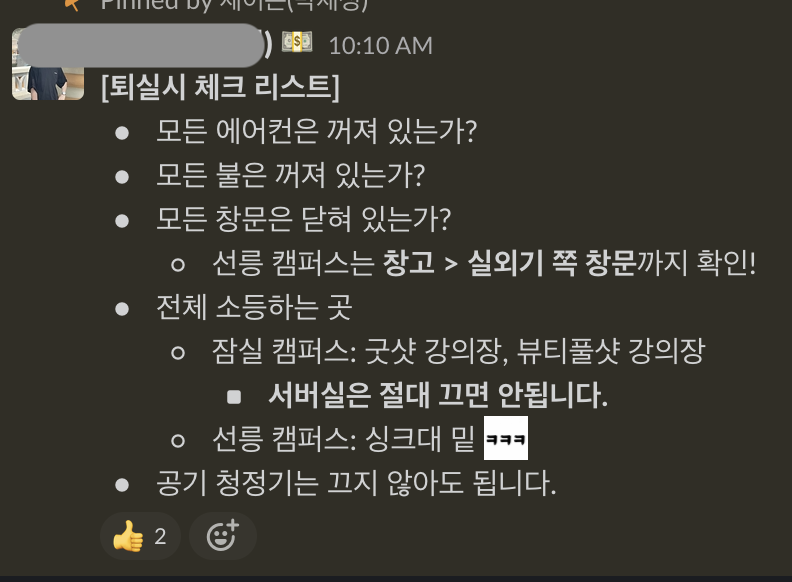
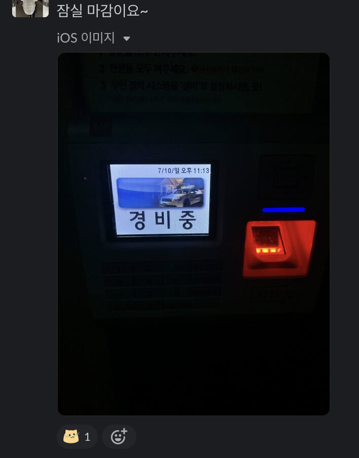
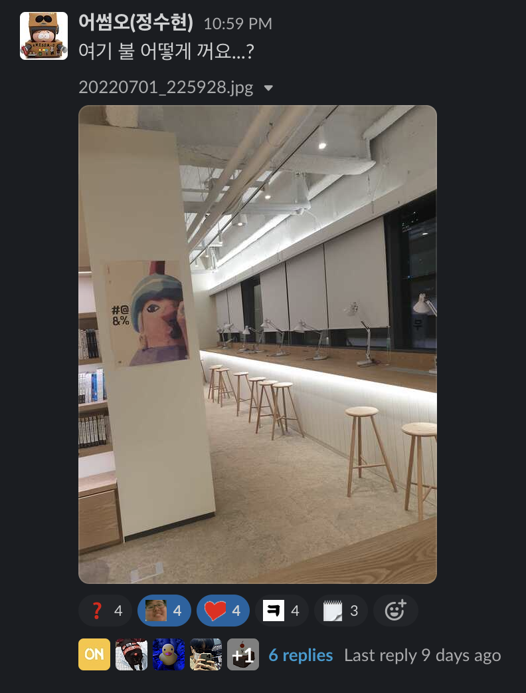

안녕하세요. "함께 사용하는 우리의 공간, 우리가 체크하자!" 
GongCheck 팀에서 프론트엔드 개발을 맡고 있는 코카콜라입니다. 
저희 팀은 우아한테크코스 4기 과정에서 공간관리 체크리스트 애플리케이션 개발을 하고 있습니다. 이번 프로젝트를 시작하면서 무엇을 해결하기 위해 GongCheck을 기획하게 된 이유를 소개하고자 합니다.

> 개발자를 설명하면 코딩을 하는 사람일까? 정확히는 우리가 살고 있는 세상에 존재하는 문제를 해결하는 사람이라고 생각한다.

---

## 지금 우리는 공간을 어떻게 사용하고 있지?
현재 우아한테크코스 크루들이 생활하고 있는 공간은 잠실, 선릉 두 곳입니다. 밤 11시까지 공간을 사용할 수 있고 마지막에 남아 있는 사람이 해당 공간의 마감을 해야 합니다. **여기서 마감이란?** 모든 전등과 에어컨을 끄고 다음과 같은 퇴실 체크리스트의 항목을 확인 한 뒤 공간을 닫아야 합니다.

	
    
퇴실시 체크 리스트

 

	
    
퇴실

 

---

## 우리가 마주하고 있는 문제 상황은 무엇일까?
우아한테크코스 교육과정이 태어난지 벌써 4년, 그리고 4기가 시작한지 대략 5개월이 지났지만 별다른 문제 없이 공간을 사용해왔습니다. 하지만 난생처음 마감을 하게 된다면? 어떻게 될까요?

	
    
퇴실시 체크리스트 확인해도 전등이 어디에 있는 모르겠다구...

### 여기 불 어떻게 꺼요?
열심히 공부를 하다 보니 밤 11시! 나 혼자 캠퍼스에 남아 있다면! 오늘 처음 마감을 하게 된 상황이라면! **여기 불 어떻게 꺼요?** 이런 상황에 직면하게 된다면 식은땀이 날 꺼예요 ㅎㅎ. 여기 전등은 어디서 끄는지, 저기 전등은 안꺼도 되는지 엘리베이터 앞 로비의 불은 꺼야 하는지, 캠퍼스 안에 있는 에어컨도 꺼야 하는데 에어컨이 한두개도 아니고 "언제 다 확인하지?" 이런 고민을 하신 분들이 많을 거라고 생각이 듭니다. 이런저런 생각 속에 "에이 몰라 대충 하고 도망가야지~" 이렇게 마감하고 가신 분들이 있을 거라 확신합니다.

 

---

## 공책(GongCheck)

	

이러한 문제상황 속에서 공간관리 애플리케이션 GongCheck이 기획되었습니다.

- 무엇을 해야 할지, 무엇이 어디에 있는지 모르는 사용자를 위해 체크리스트로 알려줍니다.
- 마감의 상황뿐만 아니라 청소 등 범용적으로 사용되는 체크리스트를 제공합니다.
- 한명의 사용자가 아닌 여러 명의 사용자가 동시에 체크리스트를 체크하는 동시성을 제공합니다.
- 공간을 관리하는 관리자 유저에게 공간관리 체크리스트 생성 기능을 제공합니다.

 

	
    
1차 데모 프로토타입(조만간 이쁜UI로 변경될듯??)

 

---

## 마치며
평소 "세상에 존재하는 문제를 디지털 기술로 해결하자"라는 생각으로 개발을 해왔습니다. 세상에 존재하는 문제가 사소한 문제일 수도 있고 사회적으로 영향을 끼치는 큰 문제일 수도 있지만, 그 문제를 디지털 기술로 해결하기 위한 첫 시작을 우아한테크코스 4기 GongCheck 팀원들과 이제 막 시작했습니다. 
저희의 과정에 대해 많은 관심 부탁드립니다.
